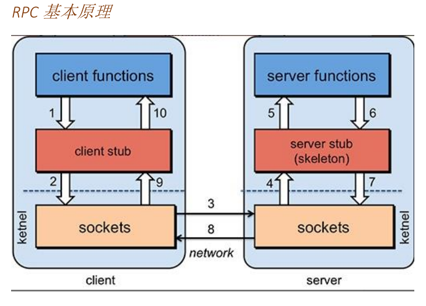
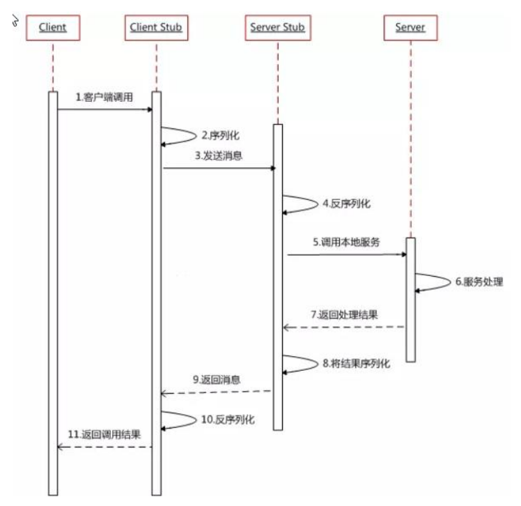
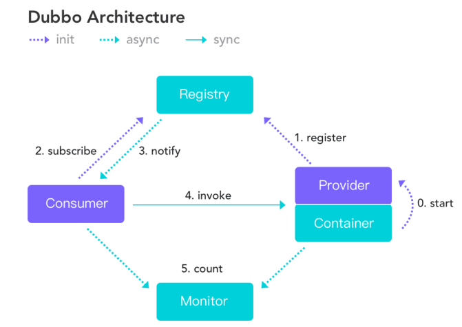
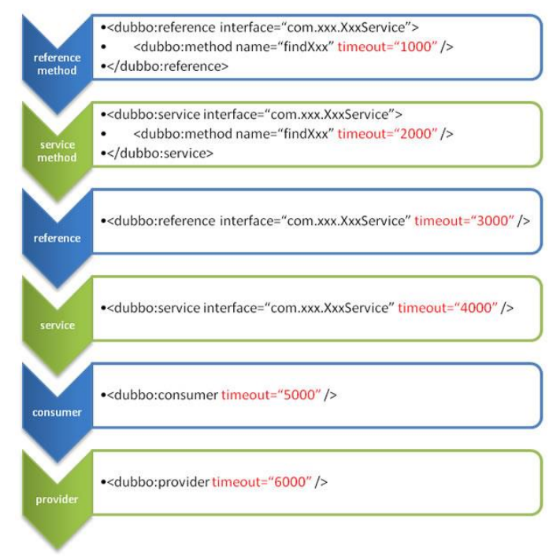

# Dubbo学习笔记

## 目录

[TOC]

## 1. RPC

* RPC是指远程调用，程序远程调用另一台机器上的函数，面不用程序员显示的编码这个调用过程。即程序员无论是调用本地的还是远程的函数，本质上编写的调用代码基本相同。
* PC 两个核心模块：通讯，序列化





## 2. Dubbo

高性能、轻量级的开源 Java RPC 框架，它提供了三大核心能力：面向接口的远程方法调用，智能容错和负载均衡，以及服务自动注册和发现。



* 服务提供者（Provider）：暴露服务的服务提供方，服务提供者在启动时，向注册中心注册自己提供的服务。
* 服务消费者（Consumer）: 调用远程服务的服务消费方，服务消费者在启动时，向注册中心订阅自己所需的服务，服务消费者，从提供者地址列表中，基于软负载均衡算法，选一台提供者进行调用，如果调用失败，再选另一台调用。
* 注册中心（Registry）：注册中心返回服务提供者地址列表给消费者，如果有变更，注册中心将基于长连接推送变更数据给消费者
* 监控中心（Monitor）：服务消费者和提供者，在内存中累计调用次数和调用时间，定时每分钟发送一次统计数据到监控中心
* 调用关系说明:
    * 服务容器负责启动，加载，运行服务提供者。
    * 服务提供者在启动时，向注册中心注册自己提供的服务。
    * 服务消费者在启动时，向注册中心订阅自己所需的服务。
    * 注册中心返回服务提供者地址列表给消费者，如果有变更，注册中心将基于长连接推送变更数据给消费者。
    * 服务消费者，从提供者地址列表中，基于软负载均衡算法，选一台提供者进行调用，如果调用失败，再选另一台调用。
    * 服务消费者和提供者，在内存中累计调用次数和调用时间，定时每分钟发送一次统计数据到监控中心。

### 2.1 注册中心软件安装

* 软件下载后，conf目录下创建`zoo.cfg`文件
    * `dataDir=./` 临时数据存储的目录（可写相对路径）
    * `clientPort=2181` zookeeper 的端口号
* bin目录下的`zkServer.cmd`启动服务
* dubbo-admin：在github上

## 3. 环境搭建

* 引入依赖

```xml
<dependency>
    <groupId>org.apache.dubbo</groupId>
    <artifactId>dubbo</artifactId>
    <version>2.7.3</version>
</dependency>
<dependency>
    <groupId>org.apache.dubbo</groupId>
    <artifactId>dubbo-dependencies-zookeeper</artifactId>
    <version>2.7.3</version>
    <type>pom</type>
</dependency>
```

* 服务消费者调用服务生产者的方法，类的抽象接口就公共提取出来(服务模型)
* 实体类也应该提取出来
* 在服务提供者与消费者的代码中，只应写实现类
* 服务提供者

```java
public class UserServiceImpl implements UserService {

    @Override
    public User getUserByUserId(Long userId) {
        User user = new User(1L, "张三", "男", 18);
        return user;
    }
}
```

```java
public class MainApplication {
    public static void main(String[] args) throws IOException {
        ClassPathXmlApplicationContext ioc = new ClassPathXmlApplicationContext("provider.xml");
        ioc.start();
        System.in.read();
    }
}
```

* provider.xml

```xml
<!-- 指定当前服务的名字，唯一 -->
<dubbo:application name="user-service-provider"/>

<!--指定注册中心，位置-->
<dubbo:registry address="zookeeper://127.0.0.1:2181" />

<!--指定通信规则-->
<dubbo:protocol name="dubbo" port="20080" />

<!--暴露服务，ref为暴露的对象-->
<bean id="userService" class="org.example.service.impl.UserServiceImpl" />
<dubbo:service interface="org.example.service.UserService" ref="userService"></dubbo:service>
```

* 服务消费者

```java
@Service
public class OrderServiceImpl implements OrderService {

    @Autowired
    private UserService userService;

    @Override
    public User getUser() {
        return userService.getUserByUserId(1L);
    }
}
```

```xml
<context:component-scan base-package="org.example" />

<!--指定当前服务名-->
<dubbo:application name="order-service-consumer" />

<!--指定注册中心-->
<dubbo:registry address="zookeeper://127.0.0.1:2181" />

<!--声明调用的远程服务接口，生成代理对象-->
<dubbo:reference interface="org.example.service.UserService" id="userService">
</dubbo:reference>
```

## 4. Dubbo配置

### 4.1 配置原则

* JVM 启动 -D 参数优先，这样可以使用户在部署和启动时进行参数重写，比如在启动时需改变协议的端口。
* XML 次之，如果在 XML 中有配置，则 dubbo.properties 中的相应配置项无效。
* Properties 最后，相当于缺省值，只有 XML 没有配置时，dubbo.propertie 的相应配置项才会生效，通常用于共享公共配置，比如应用名。
* dubbo 推荐在 Provider 上尽量多配置 Consumer 端属性：
    1. 作服务的提供者，比服务使用方更清楚服务性能参数，如调用的超时时间，合理的重试次数，等等
    2. 在 Provider 配置后，Consumer 不配置则会使用 Provider 的配置值，即 Provider 配置可以作为Consumer 的缺省值。否则，Consumer 会使用 Consumer 端的全局设置，这对于 Provider 不可控的，并且往往是不合理的
* 配置的覆盖规则：
    1. 方法级配置别优于接口级别，即小 Scope 优先
    2. Consumer 端配置 优于 Provider 配置 优于 全局配置，
    3. 最后是 Dubbo Hard Code 的配置值（见配置文档）



### 4.2 启动检查

* Dubbo 缺省会在启动时检查依赖的服务是否可用，不可用时会抛出异常，阻止 Spring 初始化完成，以便上线时，能及早发现问题，默认 `check="true"`
* 关闭某个报备的启动检查(没有提供者时报错)
    * `<dubbo:reference interface="com.foo.BarService" check="false" />`
* 关闭所有服务的启动时检查 (没有提供者时报错)： 
    * `<dubbo:consumer check="false" />`
* 关闭注册中心启动时检查 (注册订阅失败时报错)： 
    * `<dubbo:registry check="false" />`

### 4.3 超时时间

* 消费端

```xml
<!-- 全局超时配置 -->
<dubbo:consumer timeout="5000" />
<!-- 指定接口以及特定方法超时配置 -->
<dubbo:reference interface="com.foo.BarService" timeout="2000">
    <dubbo:method name="sayHello" timeout="3000" />
</dubbo:reference>
```

* 服务端

```xml
<!-- 全局超时配置 -->
<dubbo:provider timeout="5000" />
<!-- 指定接口以及特定方法超时配置 -->
<dubbo:provider interface="com.foo.BarService" timeout="2000">
    <dubbo:method name="sayHello" timeout="3000" />
</dubbo:provider>
```

### 4.4 重试次数

失败自动切换，当出现失败，重试其它服务器，但重试会带来更长延迟。可通过 retries="2" 来设置重试次数(不含第一次)。

```xml
<!-- 重试次数配置如下： -->
<dubbo:service retries="2" />
<!-- 或 -->
<dubbo:reference retries="2" />
<!-- 或 -->
<dubbo:reference>
    <dubbo:method name="findFoo" retries="2" />
</dubbo:reference>
```

### 4.5 版本控制

* 当一个接口实现，出现不兼容升级时，可以用版本号过渡，版本号不同的服务相互间不引用。
* 可以按照以下的步骤进行版本迁移：
    * 在低压力时间段，先升级一半提供者为新版本
    * 再将所有消费者升级为新版本
    * 然后将剩下的一半提供者升级为新版本

```xml
<!-- 老版本服务提供者配置： -->
<dubbo:service interface="com.foo.BarService" version="1.0.0" />
<!-- 新版本服务提供者配置： -->
<dubbo:service interface="com.foo.BarService" version="2.0.0" />
<!-- 老版本服务消费者配置： -->
<dubbo:reference id="barService" interface="com.foo.BarService" version="1.0.0" />
<!-- 新版本服务消费者配置： -->
<dubbo:reference id="barService" interface="com.foo.BarService" version="2.0.0" />
<!-- 如果不需要区分版本，可以按照以下的方式配置： -->
<dubbo:reference id="barService" interface="com.foo.BarService" version="*" />
```

### 4.7 本地存根

* 客户端先调用本地的实例stub，做一些判断，stub可以决定去不去调用远程实例
* Stub 必须有可传入 Proxy 的构造函数。
* 静态代理

```java
public class UserServiceStub implements UserService {
    private UserService userService;

    // 构造函数传入真正的远程代理对象
    public UserServiceStub(UserService userService) {
        this.userService = userService;
    }

    @Override
    public User getUserByUserId(Long userId) {
        System.out.println("stub");
        if (userId != null) {
            return userService.getUserByUserId(userId);
        }
        return null;
    }
}
```

```xml
<dubbo:reference interface="org.example.service.UserService" id="userService" stub="org.example.service.impl.UserServiceStub">
</dubbo:reference>
```

## 5. 整合SpringBoot

* 引入依赖

```xml
<dependency>
    <groupId>org.apache.dubbo</groupId>
    <artifactId>dubbo-spring-boot-starter</artifactId>
    <version>2.7.3</version>
</dependency>
<dependency>
    <groupId>org.apache.curator</groupId>
    <artifactId>curator-framework</artifactId>
    <version>2.8.0</version>
</dependency>
<dependency>
    <groupId>org.apache.curator</groupId>
    <artifactId>curator-recipes</artifactId>
    <version>2.8.0</version>
</dependency>
```

* application.yaml

```yaml
dubbo:
  application:
    name: boot-user-serivce-provider

  registry:
    address: zookeeper://127.0.0.1:2181

  metadata-report:
    address: zookeeper://127.0.0.1:2181

# 提供者要有以下
  protocol:
    name: dubbo
    port: 20080
```

* 开启dubbo

```java
@SpringBootApplication
@EnableDubbo
public class BootUserSerivceProviderApplication {
    public static void main(String[] args) {
        SpringApplication.run(BootUserSerivceProviderApplication.class, args);
    }
}
```

* 使用`@org.apache.dubbo.config.annotation.Service`注解暴露实例
* 使用`@Reference`注解，声明远程服务代理
* 配置类

```java
@Configuration
public class DubboConfig {

    @Autowired
    private UserService userService;

    @Bean
    public ApplicationConfig applicationConfig() {
        ApplicationConfig applicationConfig = new ApplicationConfig();
        applicationConfig.setName("user-service-provider-class");
        return applicationConfig;
    }

    @Bean
    public RegistryConfig registryConfig() {
        RegistryConfig registryConfig = new RegistryConfig();
        registryConfig.setProtocol("zookeeper");
        registryConfig.setAddress("127.0.0.1:2181");
        return registryConfig;
    }

    @Bean
    public ProtocolConfig protocolConfig() {
        ProtocolConfig protocolConfig = new ProtocolConfig();
        protocolConfig.setName("dubbo");
        protocolConfig.setPort(20082);
        return protocolConfig;
    }
    @Bean
    public ServiceConfig<UserService> serviceConfig() {
        ServiceConfig<UserService> serviceConfig = new ServiceConfig<>();
        serviceConfig.setInterface(UserService.class);
        serviceConfig.setRef(userService);
        return serviceConfig;
    }
}
```


