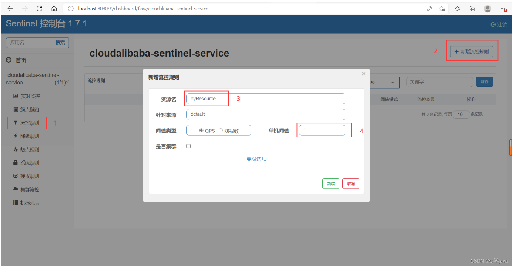

# SpringCloud学习笔记

## 目录

[TOC]

## 1. 开始

* 版本信息：<https://spring.io/projects/spring-cloud#learn>
* springboot和cloud版本对应关系：<https://spring.io/projects/spring-cloud#overview>
* 更加详细对应关系：<https://start.spring.io/actuator/info>
* 进入springcloud文档可以看到官方推荐的springboot版本
* 尚硅谷笔记：<https://blog.csdn.net/hancoder/article/details/109063671>

## 2. 服务注册

### 2.1 Eureka


#### 2.1.1 注册中心Server

* 引入依赖

```xml
<dependency>
    <groupId>org.springframework.cloud</groupId>
    <artifactId>spring-cloud-starter-netflix-eureka-server</artifactId>
</dependency>
```

* 配置文件
* `eureka.instance.hostname`实例主机地址
* `eureka.client.register-with-eureka`是否向注册中心注册自己
* `eureka.client.fetch-registry`false表示自己就是注册中心，职责是维护实例，不去检索服务
* `eureka.client.service-url.defaultZone`设置与eureka server交到的地址服务和注册都需要依赖这个地址

```yaml
eureka:
  instance:
    hostname: localhost
  client:
    register-with-eureka: false
    fetch-registry: false
    service-url:
      defaultZone: http://${eureka.instance.hostname}:${server.port}/eureka/
```

* 在主启动类上，使用`@EnableEurekaServer`注解开启eureka服务

```java
@SpringBootApplication
@EnableEurekaServer
public class EurekaServerApplication {
    public static void main(String[] args) {
        SpringApplication.run(EurekaServerApplication.class, args);
    }
}
```

#### 2.1.2 服务Client

* 服务有服务的**提供者**和**消费者**（客户端）
* 引入依赖

```xml
<dependency>
	<groupId>org.springframework.cloud</groupId>
	<artifactId>spring-cloud-starter-netflix-eureka-client</artifactId>
</dependency>
```

* 配置文件
* `spring.application.name`为注册到服务中实例的名字(一定要有)
* `eureka.client.service-url.defaultZone`注册到哪个注册中心

```xml
server:
  port: 80

spring:
  application:
    name: cloud-order-service

eureka:
  client:
    register-with-eureka: true
    fetch-registry: true
    service-url:
      defaultZone: http://localhost:7001/eureka
```


* 在主启动类上，使用`@EnableEurekaClient`注解开启eureka服务

```java
@SpringBootApplication
@EnableEurekaClient
public class OrderApplication {
    public static void main(String[] args) {
        SpringApplication.run(OrderApplication.class, args);
    }
}
```

#### 2.1.3 EurekaServer集群

* 虚拟本地域名，在etc的hosts文件中

```
127.0.0.1  eureka7001.com
127.0.0.1  eureka7002.com
```

* 每个EurekaServer注册中心之间互相注册,相互守望

```xml
server:
  port: 7001
eureka:
  instance:
    hostname: eureka7001.com
  client:
    register-with-eureka: false
    fetch-registry: false
    service-url:
      defaultZone: http://eureka7002.com:7002/eureka/
```

```xml
server:
  port: 7002
eureka:
  instance:
    hostname: eureka7002.com
  client:
    register-with-eureka: false
    fetch-registry: false
    service-url:
      defaultZone: http://eureka7001.com:7001/eureka/
```

* 因为有了多个Eureka注册中心，所以其中的Client也要注册到每一个Server中

```yaml
server:
  port: 80
spring:
  application:
    name: cloud-order-service
eureka:
  client:
    register-with-eureka: true
    fetch-registry: true
    service-url:
      defaultZone: http://eureka7001.com:7001/eureka,http://eureka7002.com:7002/eureka
```

#### 2.1.4 服务提供者集群环境

* 两个服务提供者在不同的服务器中，同时注册到多个Server中
* 使用同一个`spring.application.name`，代表是同样的服务提供者
* 此时，有了两台服务提供者，那么，在客户端中访问地埋不能写死

```java
@RestController
public class OrderController {

    public static final String PAYMENT_URL = "http://cloud-provider-payment";

    @Autowired
    private RestTemplate restTemplate;

    @PostMapping("/consumer")
    public ResponseResult savePayment(Payment payment) {
        return restTemplate.postForObject(PAYMENT_URL + "/payment", payment, ResponseResult.class);
    }

    @GetMapping("/consumer/{id}")
    public ResponseResult getPaymentById(@PathVariable Long id) {
        return restTemplate.getForObject(PAYMENT_URL + "/payment/" + id, ResponseResult.class);
    }
}
```

##### 2.1.4.1 负载均衡

* 如果是用了`RestTemplate`，可以使用`@LoadBalanced`注解

```
@Configuration
public class WebConfig {
    @Bean
    @LoadBalanced
    public RestTemplate restTemplate() {
        return new RestTemplate();
    }
}
```

#### 2.1.5 actuator微服务信息完善

* 服务名称修改
	* yaml配置文件中：`eureka.instance.instance-id={服务名称}`
* 访问信息IP提示
	* `eureka.instance.prefer-ip-address=true`

#### 2.1.6 服务发现Discovery

* 对于注册进eureka里面的微服务，可以通过服务发现来获得该服务的信息
* 在主启动上使用`@EnableDiscoveryClient`注解

```java
@Slf4j
@RestController
@RequestMapping("/payment")
public class PaymentController {

    @Autowired
    private DiscoveryClient discoveryClient;
    
    // ......

    @GetMapping("/discovery")
    public Object discovery() {
        List<String> services = discoveryClient.getServices();
        for (String service : services) {
            log.info("servcie: {}", service);
        }
        List<ServiceInstance> instances = discoveryClient.getInstances("cloud-provider-payment");
        for (ServiceInstance instance : instances) {
            log.info("{}\t{}\t{}\t{}"
                    , instance.getInstanceId(), instance.getHost(), instance.getPort(), instance.getUri());
        }
        return discoveryClient;
    }
}
```

#### 2.1.7 关闭自我保护

* 当某个微服务不可用了，Eureka不会自动清理，依旧会对该微服务的信息进行保存
* 自我保护机制是默认开启的
    * 关闭：`eureka.server.enable-self-preservation=false`
* 客户端的配置
    * 向服务器改善心跳时间间隔
    * `eureka.instance.lease-renewal-interval-in-seconds=30`
    * 服务端最后一次收到心跳等待时间上限
    * `eureka.instance.lease-expiration-duration-in-seconds=90`

### 2.3 Zookeeper

* 引入依赖

```xml
<dependency>
    <groupId>org.springframework.cloud</groupId>
    <artifactId>spring-cloud-starter-zookeeper-discovery</artifactId>
    <exclusions>
 		<!--排除掉，因为这个zookeeper依赖的版本可以与自己用的zookpeer版本不一样-->   
        <exclusion>
            <artifactId>zookeeper</artifactId>
            <groupId>org.apache.zookeeper</groupId>
        </exclusion>
    </exclusions>
</dependency>
<dependency>
    <groupId>org.apache.zookeeper</groupId>
    <artifactId>zookeeper</artifactId>
    <version>3.4.11</version>
    <exclusions>
        <exclusion>
            <artifactId>slf4j-log4j12</artifactId>
            <groupId>org.slf4j</groupId>
        </exclusion>
    </exclusions>
</dependency>
```

* springboot配置文件
* 要指定`spring.application.name`

```yaml
spring:
  application:
    name: cloud-consumerzk-order80
  cloud:
    zookeeper:
      connect-string: 127.0.0.1:2181
```

### 2.4 Consul

* 引入依赖

```xml
<dependency>
    <groupId>org.springframework.cloud</groupId>
    <artifactId>spring-cloud-starter-consul-discovery</artifactId>
</dependency>
```

* springboot配置文件
* 要指定`spring.application.name`，并设置consul的`service-name`

```yaml
spring:
  application:
    name: cloud-consumerconsul-order
  cloud:
    consul:
      host: localhost
      port: 8500
      discovery:
        service-name: ${spring.application.name}
```

### 2.5 三个注册中心的异同

| 组件名    | 语言 | CAP  | 服务健康检查 | 对外暴露接口 | SpringCloud集成 |
| --------- | ---- | ---- | ------------ | ------------ | --------------- |
| Eureka    | Java | AP   | 可配支持     | HTTP         | 已集成          |
| Consul    | Go   | CP   | 支持         | HTTP/DNS     | 已集成          |
| Zookeeper | Java | CP   | 支持         | 客户端       | 已集成          |

## 3. 服务调用

### 3.1 Ribbon

*  Ribbon客户端组件提供一系列完善的配置项如**连接超时，重试**等。简单的说，就是在配置文件中列出LoadBalancer（简称LB)后面所有的机器，Ribbon会自动的帮助你基于某种规则（如简单轮询，随机连接等）去连接这些机器。我们很容易使用Ribbon实现自定义的负载均衡算法。 
*  Ribbon本地负载均衡客户端 VS Nginx服务端负载均衡区别： 
  * Nginx是**服务器**负载均衡（集中式LB），客户端所有请求都会交给nginx，然后由nginx实现转发请求。即负载均衡是由服务端实现的。
  * Ribbon是**本地**负载均衡（进程内LB），在调用微服务接口时候，会在注册中心上获取注册信息服务列表之后缓存到JVM本地，从而在本地实现RPC远程服务调用技术。
* IRule：根据特定算法从服务列表中选择一个要访问的服务
* Ribbon 负载均衡规则类型：
	* `com.netflix.loadbalancer.RoundRobinRule`：轮询
	* `com.netflix.loadbalancer.RandomRule`：随机
	* `com.netfIix.IoadbaIancer.RetryRuIe`：先按照RoundRobinRule的策略获取服务，如果获取服务失败则在指定时间内会进行重试，获取可用的服务
	* `WeightedResponseTimeRule`：对RoundRobinRule的扩展，响应速度越快的实例选择权重越大，越容易被选择
	* `BestAvailableRule`：会先过滤掉由于多次访问故障而处于断路器跳闸状态的服务，然后选择一个并发量最小的服务
	* `AvailabilityFilteringRule`：先过滤掉故障实例，再选择并发较小的实例
	* `ZoneAvoidanceRule`：默认规则，复合判断server所在区域的性能和server的可用性选择服务器
*  使用，创建配置类， 这个自定义配置类不能放在@ComponentScan 所扫描的当前包下以及子包下，否则我们自定义的这个配置类就会被所有的Ribbon客户端所共享，达不到特殊化定制的目的了。 

```java
@Configuration
public class MySelfRule {
    @Bean
    public IRule myrule(){
        return new RandomRule(); //负载均衡规则定义为随机
    }
}

// 客户端
@SpringBootApplication
@EnableEurekaClient
@RibbonClient(value = "cloud-provider-payment", configuration = RibbonConfig.class)
public class OrderApplication {
    public static void main(String[] args) {
        SpringApplication.run(OrderApplication.class, args);
    }
}
```

### 3.2 OpenFeign

```xml
<dependency>
    <groupId>org.springframework.cloud</groupId>
    <artifactId>spring-cloud-starter-openfeign</artifactId>
</dependency>
```

* 包装了对客户端对依赖服务的调用
* 集成了`Ribbon`

#### 3.2.1 使用

* 启动类开启Feign

```java
@SpringBootApplication
@EnableFeignClients
public class OrderFeignMain80 {
    public static void main(String[] args) {
        SpringApplication.run(OrderFeignMain80.class, args);
    }
}
```

* 编写Feign服务
  * `@FeignClient`value属性为服务名称
  * 接口中的每个方法与被调用服务方法参数、返回值、注解保持一致
  * 读取value属性，通过注册中心匹配相同的服务名，访问调用

```java
@Component
@FeignClient("cloud-provider-payment")
public interface PaymentFeignService {
    @GetMapping("/payment/{id}")
    ResponseResult getPaymentById(@PathVariable("id") Long id);
}

// 被调用的服务
public ResponseResult getPaymentById(@PathVariable Long id) {
    Payment payment = paymentService.getPaymentById(id);
    if (payment != null) {
        return ResponseResult.success(serverPort + "查询成功", payment);
    }
    return ResponseResult.fail("查询失败");
}
```

* Controller调用

```java
@RestController
public class OrderController {

    @Autowired
    private PaymentFeignService paymentFeignService;

    @GetMapping("/consumer/payment/{id}")
    public ResponseResult getPaymentById(@PathVariable("id") Long id) {
        return paymentFeignService.getPaymentById(id);
    }
}
```

#### 3.2.2 超时配置

*  Openfeign默认超时等待为一秒，在**消费者**里面配置超时时间 

```yaml
eureka:
  client:
    register-with-eureka: false
    service-url:
      defaultZone: http://eureka7001.com:7001/eureka/,http://eureka7002.com:7002/eureka/
#设置feign客户端超时时间(OpenFeign默认支持ribbon)
ribbon:
  #指的是建立连接所用的时间，适用于网络状况正常的情况下,两端连接所用的时间
  ReadTimeout: 5000
  #指的是建立连接后从服务器读取到可用资源所用的时间
  ConnectTimeout: 5000
```

#### 3.2.3 日志打印

* 日志级别
  * NONE.默认的，不显示任何日志；
  * BASIC，仅记录请求方法、URL、响应状态码及执行时间；
  * HEADERS：除了BASIC中定义的信息之外，还有请求和响应的头信息
  * FULL:除了HEADERS中定义的信息之外，还有请求和响应的正文及元数据。

```java
@Configuration
public class FeignConfig {
    @Bean
    public Logger.Level feignLevel() {
        return Logger.Level.FULL;
    }
}
```

```yaml
logging:
  level:
    org.example.feign.PaymentFeignService: debug
```

## 4. 服务容错

* 即服务降级、服务熔断、服务限流
* 服务降级： 服务器忙碌或者网络拥堵时，不让客户端等待并立刻返回一个友好提示，fallback（备选方案）。 
* 服务熔断：类比保险丝达到最大服务访问后，直接拒绝访问，拉闸限电，然后调用服务降级的方法并返回友好提示
* 服务限流： 秒杀高并发等操作，严禁一窝蜂的过来拥挤，大家排队，一秒钟几个，有序进行 

### 4.1 Hystrix

```xml
<!-- hystrix -->
<dependency>
    <groupId>org.springframework.cloud</groupId>
    <artifactId>spring-cloud-starter-netflix-hystrix</artifactId>
</dependency>
```

#### 4.1.2 服务降级

##### 4.1.2.1 服务端降级

* 主启动类上使用`@EnableCircuitBreaker`注解

```java
@SpringBootApplication
@EnableEurekaClient
@EnableCircuitBreaker
public class Payment8001MainApplication {
    public static void main(String[] args) {
        SpringApplication.run(Payment8001MainApplication.class, args);
    }
}
```

* 在**方法上**使用`@HystrixCommand`注解进行降级处理
* `fallbackMethod`属性进行降级的fallback执行
* 比如：下面三秒就超时，实际要执行5秒，3秒后执行降级操作

```java
@HystrixCommand(fallbackMethod = "timeoutFallback", commandProperties = {
    @HystrixProperty(name = "execution.isolation.thread.timeoutInMilliseconds", value = "3000")
})
public String timeout(long id) {
    long threeSeconds = 1000 * 5;
    try {
        Thread.sleep(threeSeconds);
    } catch (InterruptedException e) {
        e.printStackTrace();
    }
    // int i = 10 / 0; // 模拟异常
    return "TimeOut:" + threeSeconds + "  " + id;
}
```

##### 4.1.2.2 客户端降级

```yaml
feign:
  hystrix:
    enabled: true
```

* 启动类使用`@EnableHystrix`注解

```java
@SpringBootApplication
@EnableFeignClients
@EnableHystrix
public class OrderHystrixMain {
    public static void main(String[] args) {
        SpringApplication.run(OrderHystrixMain.class);
    }
}
```

* 控制器上使用`@HystrixCommand`注解
* 表示超过1s不响应，就使用fallback备选方案

```java
@GetMapping("/consumer/timeout/{id}")
@HystrixCommand(fallbackMethod = "timeoutFallback", commandProperties = {
    @HystrixProperty(name = "execution.isolation.thread.timeoutInMilliseconds", value = "1000")
})
public String timeout(@PathVariable("id") long id) {
    return paymentHystrixService.timeout(id);
}
```

##### 4.1.2.3 全局降级

* 在控制器上使用``注解使该控制器所有的方法，需要降级的使用同一个fallback
* 需要降级的方法依然要使用`@HystrixCommand`注解，不然对应方法不会fallbak
* 全局fallback必需是无参方法

```java
@RestController
@DefaultProperties(defaultFallback = "timeoutGlobalFallback") // 必需是无参方法
public class OrderController {
    @Autowired
    private PaymentHystrixService paymentHystrixService;

    @GetMapping("/consumer/timeout/{id}")
    @HystrixCommand
    public String timeout(@PathVariable("id") long id) {
        return paymentHystrixService.timeout(id);
    }

    public String timeoutGlobalFallback() {
        return "全局    客户端繁忙，请稍候再试！o(T_T)o";
    }
}
```

##### 4.1.2.4 OpenFegin降级

* 对service调用调进行降级改造
* 实现对应的service接口

```java
@Component
public class PaymentFallbackService implements PaymentHystrixService{
    @Override
    public String ok(long id) {
        return "ok服务出现异常";
    }

    @Override
    public String timeout(long id) {
        return "timeout服务出现异常";
    }
}
```

* 在`@OpenFegin`注解使用fallback属性指定刚刚的类

```java
@Component
@FeignClient(value = "cloud-provider-payment", fallback = PaymentFallbackService.class) // 通用降级处理
public interface PaymentHystrixService {
    @GetMapping("/payment/ok/{id}")
    String ok(@PathVariable("id") long id);

    @GetMapping("/payment/timeout/{id}")
    String timeout(@PathVariable("id") long id);
}
```

#### 4.1.2 服务熔断

* 熔断打开：请求不再进行调用当前服务，内部设置时钟一般为MTTR（平均故障处理时间），当打开时长达到所设时钟则进入半熔断状态
* 熔断关闭：熔断关闭不会对服务进行熔断
* 熔断半开：**部分请求**根据规则调用当前服务，如果请求成功目符合规则，则认为当前服务恢复正常，关闭熔断。
* 大神文章：< https://martinfowler.com/bliki/CircuitBreaker.html >

```java
public String timeoutFallback(long id) {
    return "系统繁忙，请稍候再试！o(T_T)o";
}

@HystrixCommand(fallbackMethod = "timeoutFallback", commandProperties = {
    @HystrixProperty(name = "circuitBreaker.enabled", value = "true"),
    @HystrixProperty(name = "circuitBreaker.requestVolumeThreshold", value = "10"),
    @HystrixProperty(name = "circuitBreaker.sleepWindowInMilliseconds", value = "10000"),
    @HystrixProperty(name = "circuitBreaker.errorThresholdPercentage", value = "60")
})
public String circuitBreaker(long id) {
    if (id < 0) {
        throw new RuntimeException("负数");
    }

    return "访问成功：" + UUID.randomUUID().toString();
}
```

* `@HystrixProperty`中的属性在`com.netflix.hystrix.HystrixCommandProperties`类中查看
* `circuitBreaker.enabled`是否开户断路器
* `circuitBreaker.requestVolumeThreshold`请求次数
* `circuitBreaker.sleepWindowInMilliseconds`时间窗口期
* `circuitBreaker.errorThresholdPercentage`失败率指标
* 当在请求时间窗口期内请求次数的失败率超过指标后，服务接口打开（启用fallback）

#### 4.1.3 服务监控

* 导入依赖

```xml
<dependency>
    <groupId>org.springframework.cloud</groupId>
    <artifactId>spring-cloud-starter-netflix-hystrix</artifactId>
</dependency>
```

* 主方法类上使用`@EnableHystrixDashboard`注解

```java
@SpringBootApplication
@EnableHystrixDashboard
public class HystrixDashBoardMainApp {
    public static void main(String[] args) {
        SpringApplication.run(HystrixDashBoardMainApp.class, args);
    }
}
```

* 被监控的工程下要有以下依赖

```xml
<dependency>
    <groupId>org.springframework.boot</groupId>
    <artifactId>spring-boot-starter-actuator</artifactId>
</dependency>
<dependency>
    <groupId>org.springframework.boot</groupId>
    <artifactId>spring-boot-devtools</artifactId>
    <scope>runtime</scope>
    <optional>true</optional>
</dependency>
```

* 被监控的工程加入Servlet

```java
@Bean // 该servlet与服务容错本身无关，springboot默认路径不是/hustrix.stream，只要在自己的项目里自己配置servlet
public ServletRegistrationBean getServlet(){
    HystrixMetricsStreamServlet streamServlet = new HystrixMetricsStreamServlet();
    ServletRegistrationBean servletRegistrationBean = new ServletRegistrationBean(streamServlet);
    servletRegistrationBean.setLoadOnStartup(1);
    servletRegistrationBean.addUrlMappings("/hystrix.stream");
    servletRegistrationBean.setName("HystrixMetricsStreamServlet");
    return servletRegistrationBean;
}
```

## 5. 服务网关


### 5.1 GateWay

* Web请求，通过一些匹配条件，定位到真正的服务节点。并在这个转发过程的前后，进行一些**精细化控制**。
  而filter，就可以理解为一个无所不能的拦截器。有了这两个元素，再加上目标uri，就可以实现一个具体的路由了 
* GateWay三大核心概念
  * Route(路由）：路由是构建网关的基本模块，它由ID、目标URI、一系列的断言和过滤器组成，如果断言为true则匹配该路由
  * Predicate(断言）：参考的是Java8的`java.util.function.predicate`。开发人员可以匹配HTTP请求中的所有内容（例如请求头或请求参数），如果请求与断言相匹配则进行路由。
  * Filter(过滤）：指的是spring框架中GatewayFilter的实例，使用过滤器，可以在请求被路由前或者之后对请求进行修改。Filter在pre类型的过滤器可以做参数校验，权限校验，流量监听，日志输出，协议转换等

```xml
<!--gateway-->
<dependency>
    <groupId>org.springframework.cloud</groupId>
    <artifactId>spring-cloud-starter-gateway</artifactId>
</dependency>
<!--eureka-client gateWay网关作为一种微服务，也要注册进服务中心。哪个注册中心都可以，如zk-->
<dependency>
    <groupId>org.springframework.cloud</groupId>
    <artifactId>spring-cloud-starter-netflix-eureka-client</artifactId>
</dependency>
```

#### 5.1.2 路由

* 在yaml配置文件中设置固定的路由

```yaml
server:
  port: 9527
spring:
  application:
    name: cloud-gateway
  ## GateWay配置
  cloud:
    gateway:
      discovery:
        locator:
          enabled: true # 开户动态路由
      routes: #多个路由
        - id: payment_routh  # 路由ID ， 没有固定的规则但要求唯一，建议配合服务名
          uri: http://localhost:8001  # 匹配后提供服务的路由地址 #uri+predicates  # 要访问这个路径得先经过9527处理
          predicates:
            - Path=/payment/get/**  # 断言，路径相匹配的进行路由

# 注册进 eureka Server # 网关他本身也是一个微服务，也要注册进注册主中心
eureka:
  client:
    service-url:
      defaultZone: http://eureka7001.com:7001/eureka/
    register-with-eureka: true
    fetch-registry: true
```

* 当访问`/payment/get/{id}`时，会到8001的服务中匹配相同的请求，进行处理
* 可以使用代码配置类配置

```java
@Configuration
public class GateWayConfig {
    @Bean
    public RouteLocator customRouteLocator(RouteLocatorBuilder builder) {
        return builder.routes()
                .route("rute2", predicateSpec -> predicateSpec.path("/payment/discovery").uri("http://localhost:8001"))
                .build();
    }
}
```

* **动态路由：**在配置URI时使用`lb://服务名`，网关会负载均衡到该服务名的每个服务下

```yaml
spring:
  application:
    name: cloud-gateway
  ## GateWay配置
  cloud:
    gateway:
      discovery:
        locator:
          enabled: true # 开户动态路由
      routes: #多个路由
        - id: payment_routh  # 路由ID ， 没有固定的规则但要求唯一，建议配合服务名
          uri: lb://CLOUD-PROVIDER-PAYMENT # 负载均衡
          predicates:
            - Path=/payment/get/**  # 断言，路径相匹配的进行路由
```

#### 5.1.3 断言

* 在yaml中有个属性值`predicates`，用来设置断言
* 当请求条件满足断言设定时，正常请求，反之不访问
* 在某个时间之后执行`After=2017-01-20T17:42:47.789-07:00[America/Denver]`
* 在某个时间之前执行`Before=2017-01-20T17:42:47.789-07:00[America/Denver]`
* 在某个时间段内执行`Between=2017-01-20T17:42:47.789-07:00[America/Denver], 2017-01-21T17:42:47.789-07:00[America/Denver]`
* 在满足Cookie设置时匹配`Cookie=chocolate, ch.p`
* 在满足请求头时匹配`Header=X-Request-Id, \d+`
* 请求Host`Host=**.somehost.org,**.anotherhost.org`
* 请求方式`Method=GET,POST`
* 路径`Path=/red/{segment},/blue/{segment}`
* 请求参数`Query=red, gree.`
* 请求地址`RemoteAddr=192.168.1.1/24`
* 查看详细：<https://docs.spring.io/spring-cloud-gateway/docs/2.2.5.RELEASE/reference/html/#gateway-request-predicates-factories>

```yaml
spring:
  application:
    name: cloud-gateway
  ## GateWay配置
  cloud:
    gateway:
      discovery:
        locator:
          enabled: true # 开户动态路由
      routes: #多个路由
        - id: payment_routh  # 路由ID ， 没有固定的规则但要求唯一，建议配合服务名
          uri: lb://CLOUD-PROVIDER-PAYMENT
          predicates:
            - Path=/payment/get/**  # 断言，路径相匹配的进行路由
            - After=2023-09-13T20:40:45.573+08:00[Asia/Shanghai]
```

#### 5.1.3 过滤器

* 查看详细：<https://docs.spring.io/spring-cloud-gateway/docs/2.2.5.RELEASE/reference/html/#gatewayfilter-factories>

```yaml
spring:
  cloud:
    gateway:
      routes:
      - id: add_request_header_route
        uri: https://example.org
        filters:
        - AddRequestHeader=X-Request-red, blue # 添加了个请求头X-Request-red
```

* 全局过滤器，实现`GlobalFilter`接口，并放入IOC容器中

```java
@Component
public class GlobalGateWayFilter implements GlobalFilter, Ordered {
    @Override
    public Mono<Void> filter(ServerWebExchange exchange, GatewayFilterChain chain) {
        System.out.println("==========GateWay全局过滤器==========");
        String token = exchange.getRequest().getQueryParams().getFirst("token");
        if (token == null) {
            System.out.println("没有认证");
            exchange.getResponse().setStatusCode(HttpStatus.NON_AUTHORITATIVE_INFORMATION);
            return exchange.getResponse().setComplete();
        }
        return chain.filter(exchange);
    }

    @Override
    public int getOrder() {
        return 0;
    }
}
```

## 6. 服务配置

* 当服务变多了以后，需要一个中心化的外部配置，服务于各个服务

### 6.1 Config

#### 6.1.1 服务端

* 添加依赖

```xml
<!--服务端-->
<dependency>
    <groupId>org.springframework.cloud</groupId>
    <artifactId>spring-cloud-config-server</artifactId>
</dependency>
<!--客户端-->
<dependency>
    <groupId>org.springframework.cloud</groupId>
    <artifactId>spring-cloud-starter-config</artifactId>
</dependency>
```

* 配置写在远程git上，添加配置文件`application.yaml`

```yaml
server:
  port: 3344

spring:
  application:
    name: cloud-config-center
  cloud:
    #Config客户端配置
    config:
      server:
        git:
          uri: https://gitee.com/huanyv/springcloud-config.git
          username: huanyv
          password: pwd
          search-paths:
            - springcloud-config
      label: master

#服务注册到eureka地址
eureka:
  client:
    service-url:
      defaultZone: http://localhost:7001/eureka
```

* 主启动类添加注解

```java
@SpringBootApplication
@EnableConfigServer
public class ConfigMainApp {
    public static void main(String[] args) {
        SpringApplication.run(ConfigMainApp.class, args);
    }
}
```

* 访问` http://127.0.0.1:3344/master/config-dev.yml`测试

#### 6.1.2 客户端

* 添加依赖

```xml
<dependency>
    <groupId>org.springframework.cloud</groupId>
    <artifactId>spring-cloud-config-server</artifactId>
</dependency>
```

* 添加配置文件`bootstrap.yaml`，这个的优先级高于`application.yaml`

```yaml
server:
  port: 3355

spring:
  application:
    name: config-client
  cloud:
    #Config客户端配置
    config:
      uri: http://localhost:3344 #配置中心地址
      label: master #分支名称
      name: config #配置文件名称，文件也可以是client-config-dev.yml这种格式的，这里就写 client-config
      profile: dev #读取后缀名称
      # 综合上面四个 即读取配置文件地址为： http://127.0.0.1:3344/master/config-dev.yml

#服务注册到eureka地址
eureka:
  client:
    service-url:
      defaultZone: http://localhost:7001/eureka
```

#### 6.1.3 动态刷新

* 当客户端服务启动后，更新git 仓库上的配置，客户端并不会获取到最新的，这时需要开启动态刷新
* 客户端一定要有服务监控的依赖

```xml
<dependency>
    <groupId>org.springframework.boot</groupId>
    <artifactId>spring-boot-starter-actuator</artifactId>
</dependency>
```

* `bootstrap.yaml`添加配置

```yaml
server:
  port: 3355

# ........

# 暴露监控端点
management:
  endpoints:
    web:
      exposure:
        include: "*"
```

* Controller添加注解

```java
@RestController
@RefreshScope
public class TestController {
    @Value("${config.info}")
    public String config;

    @RequestMapping("/get/config")
    public String test() {
        return config;
    }
}
```

* **向客户端发送一个POST请求：**` http://127.0.0.1:3355/actuator/refresh`


## 7. 服务消息

### 7.1 Bus

* Spring Cloud Bus配置Spring Cloud Config使用可以实现配置的动态刷新
* Spring Cloud Bus是用来将分布式系统的节点与轻量级消息系统链接起来的框架，它整合了Java的事件处理机制和消息中间件的功能。
* Spring Cloud Bus目前支持RabbitMQ和Kafka（因为是主题订阅）

#### 7.1.1 广播式刷新

* 使用RabbitMQ为例
* 设计思想
	1. 传染式：利用消息总线触发一个客户端`/bus/refresh`，而刷新所有客户端的配置
	2. 分发式：利用消息总线触发一个服务端ConfigServer的`/bus/refres`端点，从而刷新所有客户端的配置，**更合适，因为单一职责**

```xml
<!-- 添加rabbitMQ的消息总线支持包，客户端和服务端都添加 -->
<dependency>
    <groupId>org.springframework.cloud</groupId>
    <artifactId>spring-cloud-starter-bus-amqp</artifactId>
</dependency>
```

* 服务端添加如下配置

```yaml
# rabbitMq的相关配置
rabbitmq:
  host: localhost
  port: 5672  # 这里没错，虽然rabbitMQ网页是 15672，5672是MQ访问的端口
  username: guest
  password: guest
# rabbitmq 的相关配置2 暴露bus刷新配置的端点
management:
  endpoints:
    web:
      exposure:
        include: 'bus-refresh'
```

* 客户端添加如下配置

```yaml
spring:
#rabbitmq相关配置 15672是Web管理界面的端口；5672是MQ访问的端口
  rabbitmq:
    host: localhost
    port: 5672
    username: guest
    password: guest

# 暴露监控端点
management:
  endpoints:
    web:
      exposure:
        include: "*"
```

* 向服务端发送`curl -X POST “http://localhost:3344/actuator/bus-refresh”`

#### 7.1.2 定点通知

*  指定具体某一个实例（的参数）生效而不是全部，一些是最新值，一些是旧值 
* <http://localhost:配置中心的端口号/actuator/bus-refresh/{destination}>

### 7.2 Stream

*  消息中间件很多，希望向上抽象一个接口，我们不关心底层用的是什么消息中间件
*  屏蔽底层消息中间件的差异，降低切换成本，**统一消息的编程模型**
* <https://spring.io/projects/spring-cloud-stream#overview>
*  通过inputs或者outputs来与SpringCloud Stream中binder对象（绑定器）交互 


* Stream标准套路
  * `binder`：很方便的连接中间件，屏蔽差异
  * `Channel`：通道，是队列Queue的一种抽象，在消息通讯系统中就是实现存储和转发的媒介，通过channel对队列进行配置
  * `Source`（生产）和`Sink`（消费）：简单地可理解为参照对象是Spring Cloud Stream自身，从Stream发布消息就是输出，接收消息就是输入


* 常用注解
  * `Middleware` 中间件，目前只支FRabbitMQ和Kafka 
  * `Binder` Binder是应用与消息中间件之间的封装，目前实行了KafKa和RabbitMQ的Binder 
  * `@Input` 注解标识输入通道，通过该输入通接收到的消息息进入应用程序 
  * `@Output` 注解标识输出通道，发布的消息将通过该通道离开应用程序 
  * `@StreamListener` 监听队列，用于消费者的队列的消息接收 
  * `@EnableBinding` 指信道channel和exchange绑定在一起 

#### 7.2.1 消息提供者

* 加入依赖

```xml
<dependency>
    <groupId>org.springframework.cloud</groupId>
    <artifactId>spring-cloud-starter-stream-rabbit</artifactId>
</dependency>
```

* application.yaml

```yaml
server:
  port: 8801

spring:
  application:
    name: cloud-stream-provider
  cloud:
    stream:
      binders: # 在此配置要绑定的rabbitMQ的服务信息
        defaultRabbit: # 表示定义的名称，用于和binding整合
          type: rabbit  # 消息组件类型
          environment: # 设置rabbitmq的相关环境配置
            spring:
              rabbitmq:
                host: 192.168.199.227
                port: 5672
                username: guest
                password: guest
      bindings: # 服务的整合处理
        output: # 表示是生产者，向rabbitMQ发送消息
          destination: studyExchange  # 表示要使用的Exchange名称
          content-type: application/json  # 设置消息类型，本次是json，文本是 "text/plain"
          binder: defaultRabbit  # 设置要绑定的消息服务的具体配置

eureka:
  client:
    service-url:
      defaultZone: http://localhost:7001/eureka/
  instance:
    lease-renewal-interval-in-seconds: 2 # 设置心跳时间，默认是30秒
    lease-expiration-duration-in-seconds: 5 # 最大心跳间隔不能超过5秒,默认90秒
    instance-id: send-8801.com # 在信息列表显示主机名称
    prefer-ip-address: true # 访问路径变为ip地址
```

* 编写业务类

```java
@EnableBinding(Source.class)
public class StreamProviderServiceImpl implements StreamProviderService {

    @Resource
    private MessageChannel output; // 必须叫 output

    @Override
    public String send() {
        String msg = UUID.randomUUID().toString();
        output.send(MessageBuilder.withPayload(msg).build());
        System.out.println("------>" + msg);
        return "发送成功";
    }
}
```

#### 7.2.2 消息消费者

```xml
<dependency>
    <groupId>org.springframework.cloud</groupId>
    <artifactId>spring-cloud-starter-stream-rabbit</artifactId>
</dependency>
```

```yaml
spring:
  application:
    name: cloud-stream-consumer8802
  cloud:
    stream:
      binders: # 在次配置要绑定的rabbitMQ的服务信息
        defaultRabbit: # 表示定义的名称，用于和binding整合
          type: rabbit  # 消息组件类型
          environment: # 设置rabbitmq的相关环境配置
            spring:
              rabbitmq:
                host: 192.168.199.227
                port: 5672
                username: guest
                password: guest
      bindings: # 服务的整合处理
        input: # 表示是消费者，这里是唯一和生产者不同的地方，向rabbitMQ发送消息
          destination: studyExchange  # 表示要使用的Exchange名称
          content-type: application/json  # 设置消息类型，本次是json，文本是 "text/plain"
          binder: defaultRabbit  # 设置要绑定的消息服务的具体配置
eureka:
  client:
    service-url:
      defaultZone: http://localhost:7001/eureka/
  instance:
    lease-renewal-interval-in-seconds: 2 # 设置心跳时间，默认是30秒
    lease-expiration-duration-in-seconds: 5 # 最大心跳间隔不能超过5秒,默认90秒
    instance-id: receive-8802.com # 在信息列表显示主机名称
    prefer-ip-address: true # 访问路径变为ip地址
```

* 消息接收

```java
@Component
@EnableBinding(Sink.class)
public class StreamController {

    @Value("${server.port}")
    private String port;

    @StreamListener(Sink.INPUT)
    public void receive(Message<String> message) {
        System.out.println(port + "接收到消息------>" + message.getPayload());
    }
}
```

#### 7.2.3 分组消费

* 当有多个消息消费者时，提供者发出消息，多个消费者同时收到消息，属于**重复消费**
* 在Stream中处于不同级的消费者会重复消费，默认不同的微服务是不同组
* 加上group配置，就已经实现了消息的持久化。 

```yaml
	# 8802 的消费者
	bindings:
        input:   
          destination: studyExchange  
          content-type: application/json  
          binder: defaultRabbit  
          group: dkfA  # 自定义分组配置
          
    # 8803 的消费者
	bindings:
        input:   
          destination: studyExchange  
          content-type: application/json  
          binder: defaultRabbit  
          group: dkfA  # 自定义分组配置
```

## 8. SpringCloud Alibaba

### 8.1 Nacos

* Nacos： 服务注册和配置中心 
* 下载：<https://github.com/alibaba/nacos/releases>
  * bin目录使用`startup.cmd`启动，2.0以上版本要
* 官方文档：<https://spring-cloud-alibaba-group.github.io/github-pages/hoxton/en-us/index.html#_spring_cloud_alibaba_nacos_discovery>
* 官网：<https://nacos.io/zh-cn/docs/feature-list.html>
* 父工程pom

```xml
<dependencyManagement>
    <dependencies>
        <dependency>
            <groupId>com.alibaba.cloud</groupId>
            <artifactId>spring-cloud-alibaba-dependencies</artifactId>
            <version>2.1.1.BUILD-SNAPSHOT</version>
            <type>pom</type>
            <scope>import</scope>
        </dependency>
    </dependencies>
</dependencyManagement>
```

* 子工程pom

```xml
<!-- springcloud alibaba nacos 依赖 -->
<dependency>
    <groupId>com.alibaba.cloud</groupId>
    <artifactId>spring-cloud-starter-alibaba-nacos-discovery</artifactId>
</dependency>
```

#### 8.1.1 服务注册

* 服务提供者

```yaml
server:
  port: 9001
spring:
  application:
    name: nacos-provider
  cloud:
    nacos:
      discovery:
        server-addr: localhost:8848
management:
  endpoints:
    web:
      exposure:
        include: '*'
```

```java
@SpringBootApplication
@EnableDiscoveryClient
public class NacosProvider9001 extends SpringBootServletInitializer {
    public static void main(String[] args) {
        SpringApplication.run(NacosProvider9001.class, args);
    }
}
```

* 服务消费者
* Nacos自带Ribbon，直接使用RestTemplate即可负载均衡

```yaml
server:
  port: 83
spring:
  application:
    name: nacos-consumer
  cloud:
    nacos:
      discovery:
        server-addr: localhost:8848

service-url:
  nacos-service-url: http://nacos-provider # 服务提供者的应用名【地址】
```

```java
@Configuration
public class WebConfig {
    @Bean
    @LoadBalanced
    public RestTemplate restTemplate() {
        return new RestTemplate();
    }
}
```

```java
@SpringBootApplication
@EnableDiscoveryClient
public class NacosConsumer83 extends SpringBootServletInitializer {
    public static void main(String[] args) {
        SpringApplication.run(NacosConsumer83.class, args);
    }
}
```

```java
@RestController
public class ConsumerController {

    @Autowired
    private RestTemplate restTemplate;

    @Value("${service-url.nacos-service-url}")
    private String serviceUrl;

    @GetMapping(value = "/consumer/payment/nacos/{id}")
    public String getPayment(@PathVariable("id") Integer id) {
        return restTemplate.getForObject(serviceUrl + "/payment/nacos/" + id, String.class);
    }
}
```

* 服务注册中心对比


#### 8.1.2 服务配置

* 导入依赖

```xml
<dependency>
    <groupId>com.alibaba.cloud</groupId>
    <artifactId>spring-cloud-alibaba-nacos-config</artifactId>
</dependency>
<dependency>
    <groupId>com.alibaba.cloud</groupId>
    <artifactId>spring-cloud-alibaba-nacos-discovery</artifactId>
</dependency>
```

* bootstrap.yaml

```yaml
server:
  port: 3377

spring:
  application:
    name: nacos-config-client
  cloud:
    nacos:
      discovery:
        server-addr: localhost:8848 #Nacos服务注册中心地址
      config:
        server-addr: localhost:8848 #Nacos作为配置中心地址
        file-extension: yaml #指定yaml格式的配置
```

* application.yaml

```yaml
spring:
  profiles:
    active: dev
```

* 主启动类

```java
@SpringBootApplication
@EnableDiscoveryClient
public class NacosConfigClient3377 extends SpringBootServletInitializer {
    public static void main(String[] args) {
        SpringApplication.run(NacosConfigClient3377.class, args);
    }
}
```

* 获取配置

```java
@RestController
@RefreshScope // 自动更新、热加载配置
public class TestController {

    @Value("${config.info}")
    public String config;

    @GetMapping("/nacos/config")
    public String config() {
        return config;
    }
}
```

* 项目启动时，会获取配置文件，所以要先加上配置，然后启动应用
* bootstrap优先级高于application
* Nacos根据Data Id来获取配置文件，ID规则为：`${prefix}-${spring.profiles.active}.${file-extension}`
  * `prefix`默认为`spring.application.name`的值，也可以通过配置项`spring.cloud.nacos.config.prefix`来配置。

##### 8.1.2.1 配置方案

* `dataId`
  * 就是上面这个，根据配置文件名的不同来指定不同的配置环境
* `Group`
  * 默认`DEFAULT_GROUP`，使用`spring.cloud.config.group`切换分组
* `namespace`
  * 不允许删除，可以创建一个新的命名空间，会自动给创建的命名空间一个流水号。在代码配置文件中指定
* 不同的dataid，是相互独立的，不同的group是相互隔离的，不同的namespace也是相互独立的

#### 8.1.3 持久化与集群

* 支持三种部署模式：<https://nacos.io/zh-cn/docs/deployment.html>
* 默认是内置数据库，可以使用mysql
  1. 安装数据库，版本5.6.5+
  2. 初始化数据库，数据库初始化文件：`nacos/conf/nacos-mysql.sql`。创建个database数据库`nacos_devtest`
  3. 修改`nacos/conf/application.properties`配置文件

```properties
# 切换数据库
spring.datasource.platform=mysql

db.num=1
db.url.0=jdbc:mysql://11.162.196.16:3306/nacos_devtest?characterEncoding=utf8&connectTimeout=1000&socketTimeout=3000&autoReconnect=true
db.user=root
db.password=123456
```

* 配置集群
  *  修改`nacos/conf/cluster.conf`文件，添加以下内容

```
# it is ip
# 告诉这3个集群结点是一组的 # 不能写127.0.0.1，必须是linux hostname -i能够识别的ip
192.168.1.2:3333
192.168.1.2:4444
192.168.1.2:5555
```

*  模拟三台nacos服务，编辑nacos的startup.sh脚本，使他能够支持不同的端口启动多次。 
* `nohup $JAVA -Dserver.port=${PORT} ${JAVA_POT} nacoas.nacos >> ${BASE_DIR}/logs/start.out 2>&1 &`


* 依次启动3个集群

```shell
./startup.sh -p 3333 表示启动端口号为3333的nacos服务器实例
./startup.sh -p 4444
./startup.sh -p 5555
ps -ef | grep nacos | grep -v grep | wc -l
```

* 使用Nginx做负载均衡

```
upstream cluster {
	server 127.0.0.1:3333;
	server 127.0.0.1:4444;
	server 127.0.0.1:5555;
}

server {
	listen 1111
	.....
	
	location / {
		proxy_pass http://cluster
	}
}
```

* 通过nginx访问：192.168.1.2:1111/nacos/#/login


### 8.2 Sentinel

*  Sentinel在 SpringCloud Alibaba中的作用是实现`熔断`和`限流`。类似于Hystrix
* 下载地址：<https://github.com/alibaba/Sentinel/releases/download/1.7.1/sentinel-dashboard-1.7.1.jar>
* 学习文档1：<https://juejin.cn/post/7323494008852054068>
* 学习文档2：<https://juejin.cn/post/7100184042485579812>


* 依赖

```xml
        <!-- 后续做Sentinel的持久化会用到的依赖 -->
        <dependency>
            <groupId>com.alibaba.csp</groupId>
            <artifactId>sentinel-datasource-nacos</artifactId>
        </dependency>
        <!-- sentinel  -->
        <dependency>
            <groupId>com.alibaba.cloud</groupId>
            <artifactId>spring-cloud-starter-alibaba-sentinel</artifactId>
        </dependency>
        <!-- springcloud alibaba nacos 依赖,Nacos Server 服务注册中心 -->
        <dependency>
            <groupId>com.alibaba.cloud</groupId>
            <artifactId>spring-cloud-starter-alibaba-nacos-discovery</artifactId>
        </dependency>
```

```yaml
server:
  port: 8401
spring:
  application:
    name: cloudalibaba-sentinel-service
  cloud:
    nacos:
      discovery:
        # 服务注册中心 # sentinel注册进nacos
        server-addr: localhost:8848
    sentinel:
      transport:
        # 配置 Sentinel Dashboard 的地址
        dashboard: localhost:8080
        # 默认8719 ，如果端口被占用，端口号会自动 +1，直到找到未被占用的端口，提供给 sentinel 的监控端口
        port: 8719
        
management:
  endpoints:
    web:
      exposure:
        include: '*'
```

#### 8.2.1 流控规则


* 资源名：唯一名称，默认请求路径
* 针对来源：Sentinel可以针对调用者进行限流，填写微服务名，默认default（不区分来源）
* 阈值类型/单机阈值：
    * QPS(每秒钟的请求数 Query Per Second)：当调用该api的QPS达到阈值的时候，进行限流
    * 线程数：当调用该api的线程数达到阈值时，进行限流
    * 是否集群：不需要集群
* 流控模式：
    * 直接：api达到限流条件时，直接限流
    * 关联：当关联的资源达到阈值时，就限流自己
    * 链路：只记录指定链路上的流量（指定资源从入口资源进来的流量，如果达到阈值，就进行限流）【api级别的针对来源】
* 流控效果：
    * 快速失败：直接失败，抛异常
    * Warm Up：根据codeFactor（冷加载因子，默认3）的值，从阈值/codeFactor，经过预热时长，才达到设置的QPS阈值
    * 排队等待：均速排队，让请求以匀速的速度通过，阈值类型必须设置QPS，否则无效

#### 8.2.2 流控模式-QPS -直接失败


#### 8.2.3 流控模式-线程数直接失败


#### 8.2.4 流控模式-关联

*  **当关联的资源达到阈值时，就限流自己**，当与A关联的资源B达到阀值后，就限流A自己，一句话 ：B惹事，A挂了 


#### 8.2.5 流控效果-直接-快速失败


#### 8.2.6 流控效果-预热

* 官网：<https://github.com/alibaba/Sentinel/wiki/%E6%B5%81%E9%87%8F%E6%8E%A7%E5%88%B6>
* Warm Up（RuleConstant.CONTROL_BEHAVIOR_WARM_UP）方式，即预热/冷启动方式。当系统长期处于低水位的情况下，当流量突然增加时，直接把系统拉升到高水位可能瞬间把系统压垮。通过"冷启动"，让通过的流量缓慢增加，在一定时间内逐渐增加到阈值上限，给冷系统一个预热的时间，避免冷系统被压垮。

* 默认coldFactor为3，即请求 QPS 从 threshold / 3 开始，经预热时长逐渐升至设定的 QPS 阈值。


> 应用场景如：秒杀系统在开启的瞬间，会有很多流量上来，很有可能把系统打死，预热方式就是把为了保护系统，可慢慢的把流量放进来，慢慢的把阀值增长到设置的阀值。 

#### 8.2.7 流控效果-排除等待

* 匀速排队，让请求以均匀的速度通过，阀值类型**必须设成QPS**，否则无效。
* 设置含义：/testA每秒1次请求，超过的话就排队等待，等待的超时时间为20000毫秒。
* 源码：`com.alibaba.csp.sentinel.slots.block.flow.controller.RateLimiterController`


#### 8.2.8 服务降级

* 官网：<https://github.com/alibaba/Sentinel/wiki/熔断降级>
* Sentinel 熔断降级会在调用链路中某个资源出现不稳定状态时（例如调用超时或异常比例升高），对这个资源的调用进行限制，让请求快速失败，避免影响到其它的资源而导致级联错误。 
* 当资源被降级后，在接下来的降级时间窗口之内，对该资源的调用都自动熔断（默认行为是抛出 DegradeException）。
* 值得注意的是 ：Sentinel的断路器是没有半开状态的


- RT（平均响应时间，秒级）
  - 平均响应时间 超出阈值 且 在时间窗口内通过的请求>=5，两个条件同时满足后触发降级
  - 熔断时长(过后关闭断路器
  - RT最大4900（更大的需要通过-Dcsp.sentinel.statistic.max.rt=XXXX才能生效）
- 异常比列（秒级）
  - QPS >= 5 且异常比例（秒级统计）超过阈值时，触发降级；熔断时长(结束后，关闭降级 异常数（分钟级）
- 异常数（分钟统计）
  - 超过阈值时，触发降级；熔断时长(结束后，关闭降级


##### 8.2.8.1 RT


* 一秒中进来 5 个请求，并且 200 毫秒处理一次任务。
* 如果一秒钟持续进入 10 个请求， 且 200 毫秒还没处理完，在未来 1 秒钟的熔断时长内，断路器打开，微服务不可用 。

##### 8.2.8.2 异常比例


* 1s内，正确率 在 80%，10个请求，最多出现两个异常数，低于 80% ，熔断时长内该服务不可用

##### 8.2.8.3 异常数


* 异常数 达到 5 次后 ，先熔断后降级 。

#### 8.2.9 热点Key规则

* 热点即经常访问的数据，很多时候我们希望统计或者限制某个热点数据中访问频次最高的TopN数据，并对其访问进行限流或者其它操作
* 官网：<https://github.com/alibaba/Sentinel/wiki/%E7%83%AD%E7%82%B9%E5%8F%82%E6%95%B0%E9%99%90%E6%B5%81>
* `@SentinelResource`

```java
public class FlowLimitController{
    @GetMapping("/testHotKey")
    @SentinelResource(value = "testHotKey",blockHandler = "deal_testHotKey")
    public String testHotKey(@RequestParam(value = "p1",required = false) String p1,
                             @RequestParam(value = "p2",required = false) String p2){
        return "------testHotKey";
    }
     // 兜底的方法，
    public String deal_testHotKey(String p1, String p2, BlockException exception){
        return "------deal_testHotKey,o(╥﹏╥)o";  //sentinel系统默认的提示：Blocked by Sentinel (flow limiting)
    }
}    
```


* 参数例外项


#### 8.2.10 系统级规则

* 官网：<https://github.com/alibaba/Sentinel/wiki/系统自适应限流>


#### 8.2.11 @SentinelResource

```java
@RestController
public class RateLimitController {

    @GetMapping("/byResource")
    @SentinelResource(value = "byResource", blockHandler = "handleException")
    public CommonResult byResource() {
        return new CommonResult(200,"按资源名称限流测试ok", new Payment(2020L, "serial001"));
    }

    public CommonResult handleException(BlockException exception) {
        return new CommonResult(444, exception.getClass().getCanonicalName() + "\t 服务不可用");
    }

    @GetMapping("/rateLimit/byUrl")
    @SentinelResource(value = "byUrl")
    public CommonResult byUrl() {
        return new CommonResult(200, "按url限流测试ok", new Payment(2020L, "serial002"));
    }
}


```

* 根据资源



* 自定义处理抽离

```java
public class CustomerBlockHandler {
    public static CommonResult handlerException(BlockException exception) {
        return new CommonResult(444, "按客户自定义, global handlerException----1");
    }

    public static CommonResult handlerException2(BlockException exception) {
        return new CommonResult(444, "按客户自定义, global handlerException-----2");
    }
}
```

```java
@RestController
public class RateLimitController {

    //  使用自定义限流处理类 CustomerBlockHandler
    @GetMapping("/rateLimit/CustomerBlockHandler")
    @SentinelResource(value = "CustomerBlockHandler", blockHandlerClass = CustomerBlockHandler.class, blockHandler = "handlerException2")
    public CommonResult CustomerBlockHandler() {
        return new CommonResult(200, "按自定义限流处理类限流测试ok", new Payment(2020L, "serial003"));
    }
}
```


#### 8.2.12 Fallback

* blockHandler负责sentinel配置
* fallback负责业务异常

```java
@RestController
@Slf4j
public class CircleBreakController {
    public static final String SERVICE_URL = "http://nacos-payment-provider";

    @Autowired
    private RestTemplate restTemplate;

    @RequestMapping("/consumer/fallback/{id}")
    //@SentinelResource(value = "fallback")//第一种情况，什么都没有配置
    //@SentinelResource(value = "fallback", fallback = "handlerFallback")//第二种情况，只配fallback，fallback只负责业务异常
    //@SentinelResource(value = "fallback", blockHandler = "blockHandler")//第三种情况，只配blockHandler，负责sentinel控制台配置违规
    @SentinelResource(value = "fallback", fallback = "handlerFallback", blockHandler = "blockHandler")//第四种情况，fallback和blockHandler都配置
    public CommonResult<Payment> fallback(@PathVariable Long id)
    {
        CommonResult<Payment> result = restTemplate.getForObject(SERVICE_URL + "/paymentSQL/"+id, CommonResult.class,id);

        if (id == 4) {
            throw new IllegalArgumentException ("IllegalArgumentException,非法参数异常....");
        }else if (result.getData() == null) {
            throw new NullPointerException ("NullPointerException,该ID没有对应记录,空指针异常");
        }

        return result;
    }
    //fallback
    public CommonResult handlerFallback(@PathVariable Long id, Throwable e) {
        Payment payment = new Payment(id, "null");
        return new CommonResult(444,"兜底异常handlerFallback, exception内容: " +e.getMessage(), payment);
    }

    //blockHandler
    public CommonResult blockHandler(@PathVariable Long id, BlockException blockException) {
        Payment payment = new Payment(id, null);
        return new CommonResult(445, "blockHandler-sentinel 限流, 无此流水: blockException: " + blockException.getMessage(), payment);
    }
}
```

#### 8.2.13 规则持久化

* 加入依赖

```xml
		<dependency>
            <groupId>com.alibaba.csp</groupId>
            <artifactId>sentinel-datasource-nacos</artifactId>
        </dependency>
```

* yaml配置


* 添加Nacos配置


```json
[{
    "resource": "/rateLimit/byUrl",
    "IimitApp": "default",
    "grade": 1,
    "count": 1, 
    "strategy": 0,
    "controlBehavior": 0,
    "clusterMode": false
}]
```

* resource: 资源名称
* limitApp: 来源应用
* grade: 阈值类型，0表示线程数，1表示QPS
* count: 单机阈值
* strategy: 流控模式，0表示直接，1表示关联，2表示链路
* controlBehavior: 流控效果，0表示快速失败，1表示Warm Up，2表示排队等待
* clusterMode: 是否集群

### 8.3 Seata

* 单体应用被拆分成微服务应用，原来的多个模块被拆分成多个独立的应用，分别使用多个独立的数据源，业务操作需要调用多个服务来完成。此时每个服务自己内部的数据一致性由本地事务来保证，但是全局的数据一致性问题没法保证。
* Seata是一款开源的**分布式事务**解决方案，致力于在微服务架构下提供高性能和简单易用的分布式事务服务。
* Seata 是一款开源的分布式事务解决方案，致力于提供高性能和简单易用的分布式事务服务。Seata 将为用户提供了 AT、TCC、SAGA 和 XA 事务模式，为用户打造一站式的分布式解决方案。


* Seata工作流程简介
	1. TC（Transaction Coordinator）事务协调器【可理解为班主任】：就是Seata，负责维护全局事务和分支事务的状态，驱动全局事务提交或回滚
    2. TM（Transaction Manager）事务管理器【可理解为班长】：标注全局@GlobalTransactional启动入口动作的微服务模块（比如订单模块），他是事务的发起者，负责定义全局事务的范围，并根据TC维护全局事务和分支事务状态，做出开始事务、提交事务、回滚事务的决议
    3. RM（Rescorce Manager）资源管理器【可理解为学生】：就是Mysql数据库本身，可以是多个RM，负责管理分支事务上的资源，向TC注册分支事务，汇报分支事务状态，驱动分支事务的调教或回滚
* 三个组件相互协作，TC以Seata 服务器(Server)形式独立部署，TM和RM则是以Seata Client的形式集成在微服务中运行


* 处理过程
    1. TM 向 TC 申请开启一个全局事务，全局事务创建成功并生成一个全局唯一的 XID；
    2. XID 在微服务调用链路的上下文中传播；
    3. RM 向 TC 注册分支事务，将其纳入 XID 对应全局事务的管辖；
    4. TM 向 TC 发起针对 XID 的全局提交或回滚决议；
    5. TC 调度 XID 下管辖的全部分支事务完成提交或回滚请求。


#### 8.3.1 安装

* 官网：<https://seata.apache.org/zh-cn/>
* GitHub下载地址： <https://github.com/apache/incubator-seata/releases>

1、创建数据库表：<https://github.com/apache/incubator-seata/blob/develop/script/server/db/mysql.sql>，或者在安装目录的`\seata\script\server\db`下

```sql
-- -------------------------------- The script used when storeMode is 'db' --------------------------------
-- the table to store GlobalSession data
CREATE TABLE IF NOT EXISTS `global_table`
(
    `xid`                       VARCHAR(128) NOT NULL,
    `transaction_id`            BIGINT,
    `status`                    TINYINT      NOT NULL,
    `application_id`            VARCHAR(32),
    `transaction_service_group` VARCHAR(32),
    `transaction_name`          VARCHAR(128),
    `timeout`                   INT,
    `begin_time`                BIGINT,
    `application_data`          VARCHAR(2000),
    `gmt_create`                DATETIME,
    `gmt_modified`              DATETIME,
    PRIMARY KEY (`xid`),
    KEY `idx_status_gmt_modified` (`status` , `gmt_modified`),
    KEY `idx_transaction_id` (`transaction_id`)
) ENGINE = InnoDB
  DEFAULT CHARSET = utf8mb4;

-- the table to store BranchSession data
CREATE TABLE IF NOT EXISTS `branch_table`
(
    `branch_id`         BIGINT       NOT NULL,
    `xid`               VARCHAR(128) NOT NULL,
    `transaction_id`    BIGINT,
    `resource_group_id` VARCHAR(32),
    `resource_id`       VARCHAR(256),
    `branch_type`       VARCHAR(8),
    `status`            TINYINT,
    `client_id`         VARCHAR(64),
    `application_data`  VARCHAR(2000),
    `gmt_create`        DATETIME(6),
    `gmt_modified`      DATETIME(6),
    PRIMARY KEY (`branch_id`),
    KEY `idx_xid` (`xid`)
) ENGINE = InnoDB
  DEFAULT CHARSET = utf8mb4;

-- the table to store lock data
CREATE TABLE IF NOT EXISTS `lock_table`
(
    `row_key`        VARCHAR(128) NOT NULL,
    `xid`            VARCHAR(128),
    `transaction_id` BIGINT,
    `branch_id`      BIGINT       NOT NULL,
    `resource_id`    VARCHAR(256),
    `table_name`     VARCHAR(32),
    `pk`             VARCHAR(36),
    `status`         TINYINT      NOT NULL DEFAULT '0' COMMENT '0:locked ,1:rollbacking',
    `gmt_create`     DATETIME,
    `gmt_modified`   DATETIME,
    PRIMARY KEY (`row_key`),
    KEY `idx_status` (`status`),
    KEY `idx_branch_id` (`branch_id`),
    KEY `idx_xid` (`xid`)
) ENGINE = InnoDB
  DEFAULT CHARSET = utf8mb4;

CREATE TABLE IF NOT EXISTS `distributed_lock`
(
    `lock_key`       CHAR(20) NOT NULL,
    `lock_value`     VARCHAR(20) NOT NULL,
    `expire`         BIGINT,
    primary key (`lock_key`)
) ENGINE = InnoDB
  DEFAULT CHARSET = utf8mb4;

INSERT INTO `distributed_lock` (lock_key, lock_value, expire) VALUES ('AsyncCommitting', ' ', 0);
INSERT INTO `distributed_lock` (lock_key, lock_value, expire) VALUES ('RetryCommitting', ' ', 0);
INSERT INTO `distributed_lock` (lock_key, lock_value, expire) VALUES ('RetryRollbacking', ' ', 0);
INSERT INTO `distributed_lock` (lock_key, lock_value, expire) VALUES ('TxTimeoutCheck', ' ', 0);
```

2、更改配置文件，在`seata-server-2.0/seata/conf`目录下`application.yml`（建议先备份）， 这里config、registry采用了Nacos，store采用db，MySQL为8.0版本。 

```yaml
#  Copyright 1999-2019 Seata.io Group.
#
#  Licensed under the Apache License, Version 2.0 (the "License");
#  you may not use this file except in compliance with the License.
#  You may obtain a copy of the License at
#
#  http://www.apache.org/licenses/LICENSE-2.0
#
#  Unless required by applicable law or agreed to in writing, software
#  distributed under the License is distributed on an "AS IS" BASIS,
#  WITHOUT WARRANTIES OR CONDITIONS OF ANY KIND, either express or implied.
#  See the License for the specific language governing permissions and
#  limitations under the License.

server:
  port: 7091

spring:
  application:
    name: seata-server

logging:
  config: classpath:logback-spring.xml
  file:
    path: ${log.home:${user.home}/logs/seata}

console:
  user:
    username: seata
    password: seata
seata:
  config:
    # support: nacos, consul, apollo, zk, etcd3
    type: nacos
    nacos:
      server-addr: 127.0.0.1:8848
      namespace:
      group: SEATA_GROUP
      username: nacos
      password: nacos
      context-path:
      ##if use MSE Nacos with auth, mutex with username/password attribute
      #access-key:
      #secret-key:
      data-id: seataServer.properties
  registry:
    # support: nacos, eureka, redis, zk, consul, etcd3, sofa
    type: nacos
    nacos:
      application: seata-server
      server-addr: 127.0.0.1:8848
      group: SEATA_GROUP
      namespace:
      cluster: default
      username: nacos
      password: nacos
      context-path:
      ##if use MSE Nacos with auth, mutex with username/password attribute
      #access-key:
      #secret-key:
  store:
    # support: file 、 db 、 redis 、 raft
    mode: db
    db:
      datasource: druid
      db-type: mysql
      driver-class-name: com.mysql.cj.jdbc.Driver
      url: jdbc:mysql://localhost:3306/seata?characterEncoding=utf8&useSSL=false&serverTimezone=GMT%2B8&rewriteBatchedStatements=true&allowPublicKeyRetrieval=true
      user: mysql
      password: mysql
      min-conn: 10
      max-conn: 100
      global-table: global_table
      branch-table: branch_table
      lock-table: lock_table
      distributed-lock-table: distributed_lock
      query-limit: 1000
      max-wait: 5000
  #  server:
  #    service-port: 8091 #If not configured, the default is '${server.port} + 1000'
  security:
    secretKey: SeataSecretKey0c382ef121d778043159209298fd40bf3850a017
    tokenValidityInMilliseconds: 1800000
    ignore:
      urls: /,/**/*.css,/**/*.js,/**/*.html,/**/*.map,/**/*.svg,/**/*.png,/**/*.jpeg,/**/*.ico,/api/v1/auth/login,/metadata/v1/**
```

3、启动`seata-server.bat`脚本，访问<http://localhost:7091>，账号密码为seata


#### 8.3.2 使用

* 引入Seata依赖

```xml
 <dependency>
     <groupId>com.alibaba.cloud</groupId>
     <artifactId>spring-cloud-starter-alibaba-seata</artifactId>
     <exclusions>
         <exclusion>
             <groupId>io.seata</groupId>
             <artifactId>seata-spring-boot-starter</artifactId>
         </exclusion>
     </exclusions>
</dependency>
<!--使用最新版本，与安装的seata对应-->
<dependency>
    <groupId>io.seata</groupId>
    <artifactId>seata-spring-boot-starter</artifactId>
    <version>2.0.0</version>
</dependency>
<dependency>
    <groupId>io.seata</groupId>
    <artifactId>seata-all</artifactId>
    <version>2.0.0</version>
</dependency>
```

* 配置yaml文件

```yaml
server:
  port: 2001

spring:
  application:
    name: seata-order-service
  cloud:
    nacos:
      discovery:
        server-addr: localhost:8848
    alibaba:
      seata:
        tx-service-group: default_tx_group # 必须有这个，不然会启动报错
  datasource:
    url: jdbc:mysql://localhost:3306/seata_order
    username: root
    password: 2233
    driver-class-name: com.mysql.jdbc.Driver

seata:
  registry:
    type: nacos
    nacos:
      server-addr: 127.0.0.1:8848
      namespace: ""
      group: SEATA_GROUP
      application: seata-server
  tx-service-group: default_tx_group
  service:
    vgroup-mapping:
      default_tx_group: default
  data-source-proxy-mode: AT


# 配置mybatis规则
mybatis:
  mapper-locations: classpath:mapper/*.xml
  configuration:
    map-underscore-to-camel-case: true # 开启驼峰命名规则
logging:
  level:
    io:
      seata: info


#设置feign客户端超时时间(OpenFeign默认支持ribbon)
ribbon:
  #指的是建立连接所用的时间，适用于网络状况正常的情况下,两端连接所用的时间
  ReadTimeout: 30000
  #指的是建立连接后从服务器读取到可用资源所用的时间
  ConnectTimeout: 30000
```

* 每张Seata的业务表中，都要创建一张`undo_log`表，AT模式专用，其它模式不需要

```sql
-- the table to store seata xid data
-- 0.7.0+ add context
-- you must to init this sql for you business databese. the seata server not need it.
-- 此脚本必须初始化在你当前的业务数据库中，用于AT 模式XID记录。与server端无关（注：业务数据库）
-- 注意此处0.3.0+ 增加唯一索引 ux_undo_log
undo_log
CREATE TABLE undo_log(
  `id` bigint(20) NOT NULL AUTO_INCREMENT,
  `branch_id` bigint(20) NOT NULL,
  `xid` varchar(100) NOT NULL,
  `context` varchar(128) NOT NULL,
  `rollback_info` longblob NOT NULL,
  `log_status` int(11) NOT NULL,
  `log_created` datetime NOT NULL,
  `log_modified` datetime NOT NULL,
  `ext` varchar(100) DEFAULT NULL,
  PRIMARY KEY (`id`),
  UNIQUE KEY `ux_undo_log` (`xid`,`branch_id`)
) ENGINE=InnoDB AUTO_INCREMENT=1 DEFAULT CHARSET=utf8;
```

* 在需要事务的方法上使用`@GlobalTransactional`注解

```java
package org.example.service;

import io.seata.core.context.RootContext;
import io.seata.spring.annotation.GlobalTransactional;
import lombok.extern.slf4j.Slf4j;
import org.example.apis.AccountServiceApi;
import org.example.apis.StorageServiceApi;
import org.example.dao.OrderMapper;
import org.example.entity.Order;
import org.springframework.beans.factory.annotation.Autowired;
import org.springframework.stereotype.Service;


/**
 * @author huanyv
 * @date 2024/7/15 20:33
 */
@Service
@Slf4j
public class OrderService {

    @Autowired
    private OrderMapper orderMapper;

    @Autowired
    private StorageServiceApi storageServiceApi;

    @Autowired
    private AccountServiceApi accountServiceApi;

    /**
     * 创建订单
     *
     * @param order
     * @return
     */
    @GlobalTransactional(name = "zzyy-create-order", rollbackFor = Exception.class)
    public int createOrder(Order order) {
        String xid = RootContext.getXID();
        log.info("开始创建订单：" + xid);
        order.setStatus(0);

        int insert = orderMapper.insert(order);
        if (insert > 0) {
            log.info("订单创建成功："+xid);

            // 扣减对应库存
            storageServiceApi.decrease(order.getProductId(), order.getCount());

            // 扣减对应人余额
            accountServiceApi.decrease(order.getUserId(), order.getMoney());

            Order orderTemp = new Order();
            orderTemp.setStatus(1);
            orderTemp.setId(order.getId());
            int update = orderMapper.update(orderTemp);
            if (update > 0) {
                log.info("订单创建成功成功成功！！！！！！！！！！！！！！！！");
                return 1;
            }
        }
        return -1;
    }
}
```

* 开启该注解后，无论是在插入过程中出现异常，都会将数据插入到数据库中，并且插入一行记录在`undo_log`表中，若中途出现了异常就会触发事务的回滚，将当前插入的数据全部清空，`undo_log`表插入的数据也会删除
* 第一阶段：业务数据和回滚日志记录在同一个本地事务中提交，释放本地锁和连接资源
* 第二阶段：
  * 提交异步化，非常快速的完成
  * **回滚通过一阶段的回滚日志进行反向补偿**【undo_log的作用就是进行反向补偿】

#### 8.3.3 第一阶段

* 在第一阶段，Seata会拦截 ”业务SQL“
    1. 解析SQL语义，找到 "业务SQL"更新业务数据，在业务数据被更新前，将其保存成 “before image”
    2. 执行 “业务SQL” 更新业务数据，在业务数据更新之后
    3. 其保存成 “after image”，最后生成行锁
* 以上 操作全部在一个数据库事务内完成，这样保证了一阶段的原子性。 


#### 8.3.4 第二阶段

1、如果没有发生异常情况的话，因为业务在第一阶段已经提交到数据库，所以Seata框架只需将第一阶段的快照数据和行锁删除，即完成数据清理


2、如果发生了异常回滚，Seata需要回滚第一阶段提交的业务数据，回滚方式便是 “before image” 还原业务数据；但是还原业务前先要校验脏写，对比 “数据库当前业务数据” 和 “after image”，如果两份数据完全一致就说明没有脏写，可以还原业务数据，如果不一致就说明有脏写，出现脏写就要进行人工处理。


