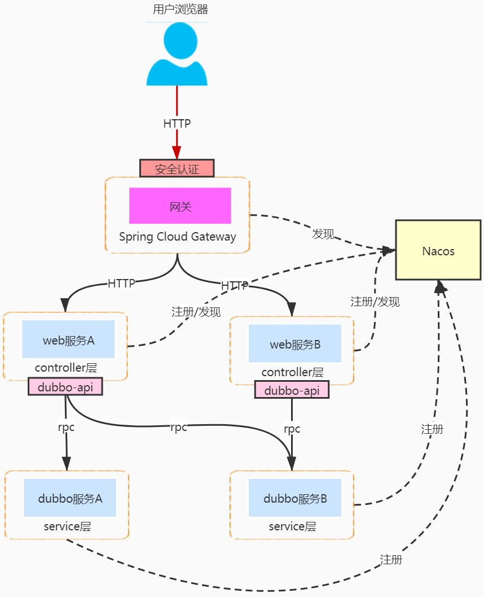

# SpringCloud学习笔记

## 目录

[TOC]

## 1. 开始

* 版本信息：<https://spring.io/projects/spring-cloud#learn>
* springboot和cloud版本对应关系：<https://spring.io/projects/spring-cloud#overview>
* 更加详细对应关系：<https://start.spring.io/actuator/info>
* 进入springcloud文档可以看到官方推荐的springboot版本
* 尚硅谷笔记：<https://blog.csdn.net/hancoder/article/details/109063671>

## 2. 服务注册

### 2.1 Eureka


#### 2.1.1 注册中心Server

* 引入依赖

```xml
<dependency>
    <groupId>org.springframework.cloud</groupId>
    <artifactId>spring-cloud-starter-netflix-eureka-server</artifactId>
</dependency>
```

* 配置文件
* `eureka.instance.hostname`实例主机地址
* `eureka.client.register-with-eureka`是否向注册中心注册自己
* `eureka.client.fetch-registry`false表示自己就是注册中心，职责是维护实例，不去检索服务
* `eureka.client.service-url.defaultZone`设置与eureka server交到的地址服务和注册都需要依赖这个地址

```yaml
eureka:
  instance:
    hostname: localhost
  client:
    register-with-eureka: false
    fetch-registry: false
    service-url:
      defaultZone: http://${eureka.instance.hostname}:${server.port}/eureka/
```

* 在主启动类上，使用`@EnableEurekaServer`注解开启eureka服务

```java
@SpringBootApplication
@EnableEurekaServer
public class EurekaServerApplication {
    public static void main(String[] args) {
        SpringApplication.run(EurekaServerApplication.class, args);
    }
}
```

#### 2.1.2 服务Client

* 服务有服务的**提供者**和**消费者**（客户端）
* 引入依赖

```xml
<dependency>
	<groupId>org.springframework.cloud</groupId>
	<artifactId>spring-cloud-starter-netflix-eureka-client</artifactId>
</dependency>
```

* 配置文件
* `spring.application.name`为注册到服务中实例的名字(一定要有)
* `eureka.client.service-url.defaultZone`注册到哪个注册中心

```xml
server:
  port: 80

spring:
  application:
    name: cloud-order-service

eureka:
  client:
    register-with-eureka: true
    fetch-registry: true
    service-url:
      defaultZone: http://localhost:7001/eureka
```


* 在主启动类上，使用`@EnableEurekaClient`注解开启eureka服务

```java
@SpringBootApplication
@EnableEurekaClient
public class OrderApplication {
    public static void main(String[] args) {
        SpringApplication.run(OrderApplication.class, args);
    }
}
```

#### 2.1.3 EurekaServer集群

* 虚拟本地域名，在etc的hosts文件中

```
127.0.0.1  eureka7001.com
127.0.0.1  eureka7002.com
```

* 每个EurekaServer注册中心之间互相注册,相互守望

```xml
server:
  port: 7001
eureka:
  instance:
    hostname: eureka7001.com
  client:
    register-with-eureka: false
    fetch-registry: false
    service-url:
      defaultZone: http://eureka7002.com:7002/eureka/
```

```xml
server:
  port: 7002
eureka:
  instance:
    hostname: eureka7002.com
  client:
    register-with-eureka: false
    fetch-registry: false
    service-url:
      defaultZone: http://eureka7001.com:7001/eureka/
```

* 因为有了多个Eureka注册中心，所以其中的Client也要注册到每一个Server中

```yaml
server:
  port: 80
spring:
  application:
    name: cloud-order-service
eureka:
  client:
    register-with-eureka: true
    fetch-registry: true
    service-url:
      defaultZone: http://eureka7001.com:7001/eureka,http://eureka7002.com:7002/eureka
```

#### 2.1.4 服务提供者集群环境

* 两个服务提供者在不同的服务器中，同时注册到多个Server中
* 使用同一个`spring.application.name`，代表是同样的服务提供者
* 此时，有了两台服务提供者，那么，在客户端中访问地埋不能写死

```java
@RestController
public class OrderController {

    public static final String PAYMENT_URL = "http://cloud-provider-payment";

    @Autowired
    private RestTemplate restTemplate;

    @PostMapping("/consumer")
    public ResponseResult savePayment(Payment payment) {
        return restTemplate.postForObject(PAYMENT_URL + "/payment", payment, ResponseResult.class);
    }

    @GetMapping("/consumer/{id}")
    public ResponseResult getPaymentById(@PathVariable Long id) {
        return restTemplate.getForObject(PAYMENT_URL + "/payment/" + id, ResponseResult.class);
    }
}
```

##### 2.1.4.1 负载均衡

* 如果是用了`RestTemplate`，可以使用`@LoadBalanced`注解

```
@Configuration
public class WebConfig {
    @Bean
    @LoadBalanced
    public RestTemplate restTemplate() {
        return new RestTemplate();
    }
}
```

#### 2.1.5 actuator微服务信息完善

* 服务名称修改
	* yaml配置文件中：`eureka.instance.instance-id={服务名称}`
* 访问信息IP提示
	* `eureka.instance.prefer-ip-address=true`

#### 2.1.6 服务发现Discovery

* 对于注册进eureka里面的微服务，可以通过服务发现来获得该服务的信息
* 在主启动上使用`@EnableDiscoveryClient`注解

```java
@Slf4j
@RestController
@RequestMapping("/payment")
public class PaymentController {

    @Autowired
    private DiscoveryClient discoveryClient;
    
    // ......

    @GetMapping("/discovery")
    public Object discovery() {
        List<String> services = discoveryClient.getServices();
        for (String service : services) {
            log.info("servcie: {}", service);
        }
        List<ServiceInstance> instances = discoveryClient.getInstances("cloud-provider-payment");
        for (ServiceInstance instance : instances) {
            log.info("{}\t{}\t{}\t{}"
                    , instance.getInstanceId(), instance.getHost(), instance.getPort(), instance.getUri());
        }
        return discoveryClient;
    }
}
```

#### 2.1.7 关闭自我保护

* 当某个微服务不可用了，Eureka不会自动清理，依旧会对该微服务的信息进行保存
* 自我保护机制是默认开启的
    * 关闭：`eureka.server.enable-self-preservation=false`
* 客户端的配置
    * 向服务器改善心跳时间间隔
    * `eureka.instance.lease-renewal-interval-in-seconds=30`
    * 服务端最后一次收到心跳等待时间上限
    * `eureka.instance.lease-expiration-duration-in-seconds=90`

### 2.3 Zookeeper

* 引入依赖

```xml
<dependency>
    <groupId>org.springframework.cloud</groupId>
    <artifactId>spring-cloud-starter-zookeeper-discovery</artifactId>
    <exclusions>
 		<!--排除掉，因为这个zookeeper依赖的版本可以与自己用的zookpeer版本不一样-->   
        <exclusion>
            <artifactId>zookeeper</artifactId>
            <groupId>org.apache.zookeeper</groupId>
        </exclusion>
    </exclusions>
</dependency>
<dependency>
    <groupId>org.apache.zookeeper</groupId>
    <artifactId>zookeeper</artifactId>
    <version>3.4.11</version>
    <exclusions>
        <exclusion>
            <artifactId>slf4j-log4j12</artifactId>
            <groupId>org.slf4j</groupId>
        </exclusion>
    </exclusions>
</dependency>
```

* springboot配置文件
* 要指定`spring.application.name`

```yaml
spring:
  application:
    name: cloud-consumerzk-order80
  cloud:
    zookeeper:
      connect-string: 127.0.0.1:2181
```

### 2.4 Consul

* 引入依赖

```xml
<dependency>
    <groupId>org.springframework.cloud</groupId>
    <artifactId>spring-cloud-starter-consul-discovery</artifactId>
</dependency>
```

* springboot配置文件
* 要指定`spring.application.name`，并设置consul的`service-name`

```yaml
spring:
  application:
    name: cloud-consumerconsul-order
  cloud:
    consul:
      host: localhost
      port: 8500
      discovery:
        service-name: ${spring.application.name}
```

### 2.5 三个注册中心的异同

| 组件名    | 语言 | CAP  | 服务健康检查 | 对外暴露接口 | SpringCloud集成 |
| --------- | ---- | ---- | ------------ | ------------ | --------------- |
| Eureka    | Java | AP   | 可配支持     | HTTP         | 已集成          |
| Consul    | Go   | CP   | 支持         | HTTP/DNS     | 已集成          |
| Zookeeper | Java | CP   | 支持         | 客户端       | 已集成          |

## 3. 服务调用

### 3.1 Ribbon

*  Ribbon客户端组件提供一系列完善的配置项如**连接超时，重试**等。简单的说，就是在配置文件中列出LoadBalancer（简称LB)后面所有的机器，Ribbon会自动的帮助你基于某种规则（如简单轮询，随机连接等）去连接这些机器。我们很容易使用Ribbon实现自定义的负载均衡算法。 
*  Ribbon本地负载均衡客户端 VS Nginx服务端负载均衡区别： 
  * Nginx是**服务器**负载均衡（集中式LB），客户端所有请求都会交给nginx，然后由nginx实现转发请求。即负载均衡是由服务端实现的。
  * Ribbon是**本地**负载均衡（进程内LB），在调用微服务接口时候，会在注册中心上获取注册信息服务列表之后缓存到JVM本地，从而在本地实现RPC远程服务调用技术。
* IRule：根据特定算法从服务列表中选择一个要访问的服务
* Ribbon 负载均衡规则类型：
	* `com.netflix.loadbalancer.RoundRobinRule`：轮询
	* `com.netflix.loadbalancer.RandomRule`：随机
	* `com.netfIix.IoadbaIancer.RetryRuIe`：先按照RoundRobinRule的策略获取服务，如果获取服务失败则在指定时间内会进行重试，获取可用的服务
	* `WeightedResponseTimeRule`：对RoundRobinRule的扩展，响应速度越快的实例选择权重越大，越容易被选择
	* `BestAvailableRule`：会先过滤掉由于多次访问故障而处于断路器跳闸状态的服务，然后选择一个并发量最小的服务
	* `AvailabilityFilteringRule`：先过滤掉故障实例，再选择并发较小的实例
	* `ZoneAvoidanceRule`：默认规则，复合判断server所在区域的性能和server的可用性选择服务器
*  使用，创建配置类， 这个自定义配置类不能放在@ComponentScan 所扫描的当前包下以及子包下，否则我们自定义的这个配置类就会被所有的Ribbon客户端所共享，达不到特殊化定制的目的了。 

```java
@Configuration
public class MySelfRule {
    @Bean
    public IRule myrule(){
        return new RandomRule(); //负载均衡规则定义为随机
    }
}

// 客户端
@SpringBootApplication
@EnableEurekaClient
@RibbonClient(value = "cloud-provider-payment", configuration = RibbonConfig.class)
public class OrderApplication {
    public static void main(String[] args) {
        SpringApplication.run(OrderApplication.class, args);
    }
}
```

### 3.2 OpenFeign

```xml
<dependency>
    <groupId>org.springframework.cloud</groupId>
    <artifactId>spring-cloud-starter-openfeign</artifactId>
</dependency>
```

* 包装了对客户端对依赖服务的调用
* 集成了`Ribbon`

#### 3.2.1 使用

* 启动类开启Feign

```java
@SpringBootApplication
@EnableFeignClients
public class OrderFeignMain80 {
    public static void main(String[] args) {
        SpringApplication.run(OrderFeignMain80.class, args);
    }
}
```

* 编写Feign服务
  * `@FeignClient`value属性为服务名称
  * 接口中的每个方法与被调用服务方法参数、返回值、注解保持一致
  * 读取value属性，通过注册中心匹配相同的服务名，访问调用

```java
@Component
@FeignClient("cloud-provider-payment")
public interface PaymentFeignService {
    @GetMapping("/payment/{id}")
    ResponseResult getPaymentById(@PathVariable("id") Long id);
}

// 被调用的服务
public ResponseResult getPaymentById(@PathVariable Long id) {
    Payment payment = paymentService.getPaymentById(id);
    if (payment != null) {
        return ResponseResult.success(serverPort + "查询成功", payment);
    }
    return ResponseResult.fail("查询失败");
}
```

* Controller调用

```java
@RestController
public class OrderController {

    @Autowired
    private PaymentFeignService paymentFeignService;

    @GetMapping("/consumer/payment/{id}")
    public ResponseResult getPaymentById(@PathVariable("id") Long id) {
        return paymentFeignService.getPaymentById(id);
    }
}
```

#### 3.2.2 超时配置

*  Openfeign默认超时等待为一秒，在**消费者**里面配置超时时间 

```yaml
eureka:
  client:
    register-with-eureka: false
    service-url:
      defaultZone: http://eureka7001.com:7001/eureka/,http://eureka7002.com:7002/eureka/
#设置feign客户端超时时间(OpenFeign默认支持ribbon)
ribbon:
  #指的是建立连接所用的时间，适用于网络状况正常的情况下,两端连接所用的时间
  ReadTimeout: 5000
  #指的是建立连接后从服务器读取到可用资源所用的时间
  ConnectTimeout: 5000
```

#### 3.2.3 日志打印

* 日志级别
  * NONE.默认的，不显示任何日志；
  * BASIC，仅记录请求方法、URL、响应状态码及执行时间；
  * HEADERS：除了BASIC中定义的信息之外，还有请求和响应的头信息
  * FULL:除了HEADERS中定义的信息之外，还有请求和响应的正文及元数据。

```java
@Configuration
public class FeignConfig {
    @Bean
    public Logger.Level feignLevel() {
        return Logger.Level.FULL;
    }
}
```

```yaml
logging:
  level:
    org.example.feign.PaymentFeignService: debug
```

## 4. 服务容错

* 即服务降级、服务熔断、服务限流
* 服务降级： 服务器忙碌或者网络拥堵时，不让客户端等待并立刻返回一个友好提示，fallback（备选方案）。 
* 服务熔断：类比保险丝达到最大服务访问后，直接拒绝访问，拉闸限电，然后调用服务降级的方法并返回友好提示
* 服务限流： 秒杀高并发等操作，严禁一窝蜂的过来拥挤，大家排队，一秒钟几个，有序进行 

### 4.1 Hystrix

```xml
<!-- hystrix -->
<dependency>
    <groupId>org.springframework.cloud</groupId>
    <artifactId>spring-cloud-starter-netflix-hystrix</artifactId>
</dependency>
```

#### 4.1.2 服务降级

##### 4.1.2.1 服务端降级

* 主启动类上使用`@EnableCircuitBreaker`注解

```java
@SpringBootApplication
@EnableEurekaClient
@EnableCircuitBreaker
public class Payment8001MainApplication {
    public static void main(String[] args) {
        SpringApplication.run(Payment8001MainApplication.class, args);
    }
}
```

* 在**方法上**使用`@HystrixCommand`注解进行降级处理
* `fallbackMethod`属性进行降级的fallback执行
* 比如：下面三秒就超时，实际要执行5秒，3秒后执行降级操作

```java
@HystrixCommand(fallbackMethod = "timeoutFallback", commandProperties = {
    @HystrixProperty(name = "execution.isolation.thread.timeoutInMilliseconds", value = "3000")
})
public String timeout(long id) {
    long threeSeconds = 1000 * 5;
    try {
        Thread.sleep(threeSeconds);
    } catch (InterruptedException e) {
        e.printStackTrace();
    }
    // int i = 10 / 0; // 模拟异常
    return "TimeOut:" + threeSeconds + "  " + id;
}
```

##### 4.1.2.2 客户端降级

```yaml
feign:
  hystrix:
    enabled: true
```

* 启动类使用`@EnableHystrix`注解

```java
@SpringBootApplication
@EnableFeignClients
@EnableHystrix
public class OrderHystrixMain {
    public static void main(String[] args) {
        SpringApplication.run(OrderHystrixMain.class);
    }
}
```

* 控制器上使用`@HystrixCommand`注解
* 表示超过1s不响应，就使用fallback备选方案

```java
@GetMapping("/consumer/timeout/{id}")
@HystrixCommand(fallbackMethod = "timeoutFallback", commandProperties = {
    @HystrixProperty(name = "execution.isolation.thread.timeoutInMilliseconds", value = "1000")
})
public String timeout(@PathVariable("id") long id) {
    return paymentHystrixService.timeout(id);
}
```

##### 4.1.2.3 全局降级

* 在控制器上使用``注解使该控制器所有的方法，需要降级的使用同一个fallback
* 需要降级的方法依然要使用`@HystrixCommand`注解，不然对应方法不会fallbak
* 全局fallback必需是无参方法

```java
@RestController
@DefaultProperties(defaultFallback = "timeoutGlobalFallback") // 必需是无参方法
public class OrderController {
    @Autowired
    private PaymentHystrixService paymentHystrixService;

    @GetMapping("/consumer/timeout/{id}")
    @HystrixCommand
    public String timeout(@PathVariable("id") long id) {
        return paymentHystrixService.timeout(id);
    }

    public String timeoutGlobalFallback() {
        return "全局    客户端繁忙，请稍候再试！o(T_T)o";
    }
}
```

##### 4.1.2.4 OpenFegin降级

* 对service调用调进行降级改造
* 实现对应的service接口

```java
@Component
public class PaymentFallbackService implements PaymentHystrixService{
    @Override
    public String ok(long id) {
        return "ok服务出现异常";
    }

    @Override
    public String timeout(long id) {
        return "timeout服务出现异常";
    }
}
```

* 在`@OpenFegin`注解使用fallback属性指定刚刚的类

```java
@Component
@FeignClient(value = "cloud-provider-payment", fallback = PaymentFallbackService.class) // 通用降级处理
public interface PaymentHystrixService {
    @GetMapping("/payment/ok/{id}")
    String ok(@PathVariable("id") long id);

    @GetMapping("/payment/timeout/{id}")
    String timeout(@PathVariable("id") long id);
}
```

#### 4.1.2 服务熔断

* 熔断打开：请求不再进行调用当前服务，内部设置时钟一般为MTTR（平均故障处理时间），当打开时长达到所设时钟则进入半熔断状态
* 熔断关闭：熔断关闭不会对服务进行熔断
* 熔断半开：**部分请求**根据规则调用当前服务，如果请求成功目符合规则，则认为当前服务恢复正常，关闭熔断。
* 大神文章：< https://martinfowler.com/bliki/CircuitBreaker.html >

```java
public String timeoutFallback(long id) {
    return "系统繁忙，请稍候再试！o(T_T)o";
}

@HystrixCommand(fallbackMethod = "timeoutFallback", commandProperties = {
    @HystrixProperty(name = "circuitBreaker.enabled", value = "true"),
    @HystrixProperty(name = "circuitBreaker.requestVolumeThreshold", value = "10"),
    @HystrixProperty(name = "circuitBreaker.sleepWindowInMilliseconds", value = "10000"),
    @HystrixProperty(name = "circuitBreaker.errorThresholdPercentage", value = "60")
})
public String circuitBreaker(long id) {
    if (id < 0) {
        throw new RuntimeException("负数");
    }

    return "访问成功：" + UUID.randomUUID().toString();
}
```

* `@HystrixProperty`中的属性在`com.netflix.hystrix.HystrixCommandProperties`类中查看
* `circuitBreaker.enabled`是否开户断路器
* `circuitBreaker.requestVolumeThreshold`请求次数
* `circuitBreaker.sleepWindowInMilliseconds`时间窗口期
* `circuitBreaker.errorThresholdPercentage`失败率指标
* 当在请求时间窗口期内请求次数的失败率超过指标后，服务接口打开（启用fallback）

#### 4.1.3 服务监控

* 导入依赖

```xml
<dependency>
    <groupId>org.springframework.cloud</groupId>
    <artifactId>spring-cloud-starter-netflix-hystrix</artifactId>
</dependency>
```

* 主方法类上使用`@EnableHystrixDashboard`注解

```java
@SpringBootApplication
@EnableHystrixDashboard
public class HystrixDashBoardMainApp {
    public static void main(String[] args) {
        SpringApplication.run(HystrixDashBoardMainApp.class, args);
    }
}
```

* 被监控的工程下要有以下依赖

```xml
<dependency>
    <groupId>org.springframework.boot</groupId>
    <artifactId>spring-boot-starter-actuator</artifactId>
</dependency>
<dependency>
    <groupId>org.springframework.boot</groupId>
    <artifactId>spring-boot-devtools</artifactId>
    <scope>runtime</scope>
    <optional>true</optional>
</dependency>
```

* 被监控的工程加入Servlet

```java
@Bean // 该servlet与服务容错本身无关，springboot默认路径不是/hustrix.stream，只要在自己的项目里自己配置servlet
public ServletRegistrationBean getServlet(){
    HystrixMetricsStreamServlet streamServlet = new HystrixMetricsStreamServlet();
    ServletRegistrationBean servletRegistrationBean = new ServletRegistrationBean(streamServlet);
    servletRegistrationBean.setLoadOnStartup(1);
    servletRegistrationBean.addUrlMappings("/hystrix.stream");
    servletRegistrationBean.setName("HystrixMetricsStreamServlet");
    return servletRegistrationBean;
}
```

## 5. 服务网关



### 5.1 GateWay

* Web请求，通过一些匹配条件，定位到真正的服务节点。并在这个转发过程的前后，进行一些**精细化控制**。
  而filter，就可以理解为一个无所不能的拦截器。有了这两个元素，再加上目标uri，就可以实现一个具体的路由了 
* GateWay三大核心概念
  * Route(路由）：路由是构建网关的基本模块，它由ID、目标URI、一系列的断言和过滤器组成，如果断言为true则匹配该路由
  * Predicate(断言）：参考的是Java8的`java.util.function.predicate`。开发人员可以匹配HTTP请求中的所有内容（例如请求头或请求参数），如果请求与断言相匹配则进行路由。
  * Filter(过滤）：指的是spring框架中GatewayFilter的实例，使用过滤器，可以在请求被路由前或者之后对请求进行修改。Filter在pre类型的过滤器可以做参数校验，权限校验，流量监听，日志输出，协议转换等

```xml
<!--gateway-->
<dependency>
    <groupId>org.springframework.cloud</groupId>
    <artifactId>spring-cloud-starter-gateway</artifactId>
</dependency>
<!--eureka-client gateWay网关作为一种微服务，也要注册进服务中心。哪个注册中心都可以，如zk-->
<dependency>
    <groupId>org.springframework.cloud</groupId>
    <artifactId>spring-cloud-starter-netflix-eureka-client</artifactId>
</dependency>
```

#### 5.1.2 路由

* 在yaml配置文件中设置固定的路由

```yaml
server:
  port: 9527
spring:
  application:
    name: cloud-gateway
  ## GateWay配置
  cloud:
    gateway:
      discovery:
        locator:
          enabled: true # 开户动态路由
      routes: #多个路由
        - id: payment_routh  # 路由ID ， 没有固定的规则但要求唯一，建议配合服务名
          uri: http://localhost:8001  # 匹配后提供服务的路由地址 #uri+predicates  # 要访问这个路径得先经过9527处理
          predicates:
            - Path=/payment/get/**  # 断言，路径相匹配的进行路由

# 注册进 eureka Server # 网关他本身也是一个微服务，也要注册进注册主中心
eureka:
  client:
    service-url:
      defaultZone: http://eureka7001.com:7001/eureka/
    register-with-eureka: true
    fetch-registry: true
```

* 当访问`/payment/get/{id}`时，会到8001的服务中匹配相同的请求，进行处理
* 可以使用代码配置类配置

```java
@Configuration
public class GateWayConfig {
    @Bean
    public RouteLocator customRouteLocator(RouteLocatorBuilder builder) {
        return builder.routes()
                .route("rute2", predicateSpec -> predicateSpec.path("/payment/discovery").uri("http://localhost:8001"))
                .build();
    }
}
```

* **动态路由：**在配置URI时使用`lb://服务名`，网关会负载均衡到该服务名的每个服务下

```yaml
spring:
  application:
    name: cloud-gateway
  ## GateWay配置
  cloud:
    gateway:
      discovery:
        locator:
          enabled: true # 开户动态路由
      routes: #多个路由
        - id: payment_routh  # 路由ID ， 没有固定的规则但要求唯一，建议配合服务名
          uri: lb://CLOUD-PROVIDER-PAYMENT # 负载均衡
          predicates:
            - Path=/payment/get/**  # 断言，路径相匹配的进行路由
```

#### 5.1.3 断言

* 在yaml中有个属性值`predicates`，用来设置断言
* 当请求条件满足断言设定时，正常请求，反之不访问
* 在某个时间之后执行`After=2017-01-20T17:42:47.789-07:00[America/Denver]`
* 在某个时间之前执行`Before=2017-01-20T17:42:47.789-07:00[America/Denver]`
* 在某个时间段内执行`Between=2017-01-20T17:42:47.789-07:00[America/Denver], 2017-01-21T17:42:47.789-07:00[America/Denver]`
* 在满足Cookie设置时匹配`Cookie=chocolate, ch.p`
* 在满足请求头时匹配`Header=X-Request-Id, \d+`
* 请求Host`Host=**.somehost.org,**.anotherhost.org`
* 请求方式`Method=GET,POST`
* 路径`Path=/red/{segment},/blue/{segment}`
* 请求参数`Query=red, gree.`
* 请求地址`RemoteAddr=192.168.1.1/24`
* 查看详细：<https://docs.spring.io/spring-cloud-gateway/docs/2.2.5.RELEASE/reference/html/#gateway-request-predicates-factories>

```yaml
spring:
  application:
    name: cloud-gateway
  ## GateWay配置
  cloud:
    gateway:
      discovery:
        locator:
          enabled: true # 开户动态路由
      routes: #多个路由
        - id: payment_routh  # 路由ID ， 没有固定的规则但要求唯一，建议配合服务名
          uri: lb://CLOUD-PROVIDER-PAYMENT
          predicates:
            - Path=/payment/get/**  # 断言，路径相匹配的进行路由
            - After=2023-09-13T20:40:45.573+08:00[Asia/Shanghai]
```

#### 5.1.3 过滤器

* 查看详细：<https://docs.spring.io/spring-cloud-gateway/docs/2.2.5.RELEASE/reference/html/#gatewayfilter-factories>

```yaml
spring:
  cloud:
    gateway:
      routes:
      - id: add_request_header_route
        uri: https://example.org
        filters:
        - AddRequestHeader=X-Request-red, blue # 添加了个请求头X-Request-red
```

* 全局过滤器，实现`GlobalFilter`接口，并放入IOC容器中

```java
@Component
public class GlobalGateWayFilter implements GlobalFilter, Ordered {
    @Override
    public Mono<Void> filter(ServerWebExchange exchange, GatewayFilterChain chain) {
        System.out.println("==========GateWay全局过滤器==========");
        String token = exchange.getRequest().getQueryParams().getFirst("token");
        if (token == null) {
            System.out.println("没有认证");
            exchange.getResponse().setStatusCode(HttpStatus.NON_AUTHORITATIVE_INFORMATION);
            return exchange.getResponse().setComplete();
        }
        return chain.filter(exchange);
    }

    @Override
    public int getOrder() {
        return 0;
    }
}
```

## 6. 服务配置

* 当服务变多了以后，需要一个中心化的外部配置，服务于各个服务

### 6.1 Config

#### 6.1.1 服务端

* 添加依赖

```xml
<!--服务端-->
<dependency>
    <groupId>org.springframework.cloud</groupId>
    <artifactId>spring-cloud-config-server</artifactId>
</dependency>
<!--客户端-->
<dependency>
    <groupId>org.springframework.cloud</groupId>
    <artifactId>spring-cloud-starter-config</artifactId>
</dependency>
```

* 配置写在远程git上，添加配置文件`application.yaml`

```yaml
server:
  port: 3344

spring:
  application:
    name: cloud-config-center
  cloud:
    #Config客户端配置
    config:
      server:
        git:
          uri: https://gitee.com/huanyv/springcloud-config.git
          username: huanyv
          password: pwd
          search-paths:
            - springcloud-config
      label: master

#服务注册到eureka地址
eureka:
  client:
    service-url:
      defaultZone: http://localhost:7001/eureka
```

* 主启动类添加注解

```java
@SpringBootApplication
@EnableConfigServer
public class ConfigMainApp {
    public static void main(String[] args) {
        SpringApplication.run(ConfigMainApp.class, args);
    }
}
```

* 访问` http://127.0.0.1:3344/master/config-dev.yml`测试

#### 6.1.2 客户端

* 添加依赖

```xml
<dependency>
    <groupId>org.springframework.cloud</groupId>
    <artifactId>spring-cloud-config-server</artifactId>
</dependency>
```

* 添加配置文件`bootstrap.yaml`，这个的优先级高于`application.yaml`

```yaml
server:
  port: 3355

spring:
  application:
    name: config-client
  cloud:
    #Config客户端配置
    config:
      uri: http://localhost:3344 #配置中心地址
      label: master #分支名称
      name: config #配置文件名称，文件也可以是client-config-dev.yml这种格式的，这里就写 client-config
      profile: dev #读取后缀名称
      # 综合上面四个 即读取配置文件地址为： http://127.0.0.1:3344/master/config-dev.yml

#服务注册到eureka地址
eureka:
  client:
    service-url:
      defaultZone: http://localhost:7001/eureka
```

#### 6.1.3 动态刷新

* 当客户端服务启动后，更新git 仓库上的配置，客户端并不会获取到最新的，这时需要开启动态刷新
* 客户端一定要有服务监控的依赖

```xml
<dependency>
    <groupId>org.springframework.boot</groupId>
    <artifactId>spring-boot-starter-actuator</artifactId>
</dependency>
```

* `bootstrap.yaml`添加配置

```yaml
server:
  port: 3355

# ........

# 暴露监控端点
management:
  endpoints:
    web:
      exposure:
        include: "*"
```

* Controller添加注解

```java
@RestController
@RefreshScope
public class TestController {
    @Value("${config.info}")
    public String config;

    @RequestMapping("/get/config")
    public String test() {
        return config;
    }
}
```

* **向客户端发送一个POST请求：**` http://127.0.0.1:3355/actuator/refresh`


## 7. 服务消息

### 7.1 Bus

* Spring Cloud Bus配置Spring Cloud Config使用可以实现配置的动态刷新
* Spring Cloud Bus是用来将分布式系统的节点与轻量级消息系统链接起来的框架，它整合了Java的事件处理机制和消息中间件的功能。
* Spring Cloud Bus目前支持RabbitMQ和Kafka（因为是主题订阅）

#### 7.1.1 广播式刷新

* 使用RabbitMQ为例
* 设计思想
	1. 传染式：利用消息总线触发一个客户端`/bus/refresh`，而刷新所有客户端的配置
	2. 分发式：利用消息总线触发一个服务端ConfigServer的`/bus/refres`端点，从而刷新所有客户端的配置，**更合适，因为单一职责**

```xml
<!-- 添加rabbitMQ的消息总线支持包，客户端和服务端都添加 -->
<dependency>
    <groupId>org.springframework.cloud</groupId>
    <artifactId>spring-cloud-starter-bus-amqp</artifactId>
</dependency>
```

* 服务端添加如下配置

```yaml
# rabbitMq的相关配置
rabbitmq:
  host: localhost
  port: 5672  # 这里没错，虽然rabbitMQ网页是 15672
  username: guest
  password: guest
# rabbitmq 的相关配置2 暴露bus刷新配置的端点
management:
  endpoints:
    web:
      exposure:
        include: 'bus-refresh'
```

* 客户端添加如下配置

```yaml
spring:
#rabbitmq相关配置 15672是Web管理界面的端口；5672是MQ访问的端口
  rabbitmq:
    host: localhost
    port: 5672
    username: guest
    password: guest

# 暴露监控端点
management:
  endpoints:
    web:
      exposure:
        include: "*"
```

* 向服务端发送`curl -X POST “http://localhost:3344/actuator/bus-refresh”`

#### 7.1.2


