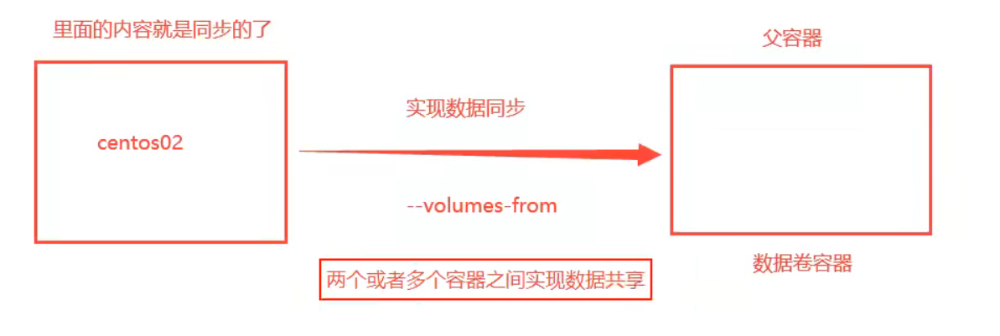

# Docker学习笔记

## 1. 安装

* 卸载旧版本

```shell
[root@192 ~]# sudo yum remove docker \
                  docker-client \
                  docker-client-latest \
                  docker-common \
                  docker-latest \
                  docker-latest-logrotate \
                  docker-logrotate \
                  docker-engine
```

1. 下载需要的安装包

```
yum install -y yum-utils
```

2. 设置阿里云Docker镜像仓库

```
yum-config-manager \
    --add-repo \
    https://mirrors.aliyun.com/docker-ce/linux/centos/docker-ce.repo 
```

3. 更新yum软件包索引

```
yum makecache fast
```

4. 安装

```
 yum install docker-ce docker-ce-cli containerd.io
```

5. 启动Docker

```
# 启动Docker
systemctl start docker

# 查看当前版本号，是否启动成功
docker version

# 设置开机自启动
systemctl enable docker
```

6. 配置阿里镜像

```
sudo mkdir -p /etc/docker
sudo tee /etc/docker/daemon.json <<-'EOF'
{
  "registry-mirrors": ["https://2y5oty1p.mirror.aliyuncs.com"]
}
EOF
sudo systemctl daemon-reload
sudo systemctl restart docke
```


## 2. 常用命令

### 2.1 基础命令

* docker version          查看docker的版本信息
* docker info             查看docker的系统信息,包括镜像和容器的数量
* docker 命令 --help       帮助命令(可查看可选的参数)
    * docker COMMAND --help
* docker --help           列出所有命令

### 2.2 镜像命令

* 拉取
    * `docker pull mysql`
    * `docker pull mysql:5.7`指定版本
* `docker images`查看所有镜像
    * `-a`列出所有镜像信息
    * `-q`只看ID
* `docker search`搜索镜像
    * `docker search mysql --filter=stars=3000`只看star数量到达3000的镜像
    * 创建地址：<https://hub.docker.com>
* `docker rmi -f id id id ...`删除镜像
    * `docker rmi -f $(docker images -qa)`删除所有镜像

### 2.3 容器命令

* `docker run [image]`运行一个容器
    * `docker run -it centos /bin/bash`
    * `--name [xxxx]`指定名字
    * `-d`后台运行
    * `-it`使用交互方式运行，进入容器查看内容
    * `-p`指定容器端口
        * `-p ip:主机端口:容器端口`
        * `-p 主机端口:容器端口`
        * `-p 容器端口`
    * `-P`随机端口
    * `--rm`用完既删
    * 退出容器`exit`
    * 保持后台退出`ctrl p q`
* `docker start [id]`启动一个已经运行过的容器
* `docker ps`显示当前**正在**运行的容器
    * `-a`列出容器运行记录
    * `-n`最近的几个容器
    * `-q`只显示容器的编号
* `docker rm [id]`删除容器，正在运行的删除不了
    * `-f`强制删除
    * `docker rm -f $(docker ps -aq)`删除所有容器
* `docker start [id]`启动一个已经运行过的容器
* `docker restart [id]`重启
* `docker stop [id]`停止当前运行的容器
* `docker kill [id]`强制停止当前运行的容器

### 2.4 其它常用命令

* `docker logs [opthions] [id]`日志
    * `-f`跟踪日志输出
    * `-t`显示时间
    * `--tail`行数
* `docker top [id]`查看容器中进程信息
* `docker inspect [id]`查看容器元数据

#### 2.4.1 进入容器

* `docker exec -it [id] /bin/bash` 进入容器后开启一个新的终端，可以在里面操作 （常用） 	
* ` docker attach [id] ` 进入容器正在执行的终端，不会启动新的进程 

#### 2.4.2 拷贝

* ` docker cp 容器id:容器内路径  目的主机路径 ` 将容器的文件拷贝到主机中
* ` docker cp 目的主机路径 容器id:容器内路径 ` 将宿主机的文件拷贝到容器中

## 3. 提交镜像

* `docker commit -m="提交的描述信息"  -a="作者" 容器id 目标镜像名:[TAG] `

## 4. 数据卷

* 本地数据与容器数据共享
*  **目录的挂载**，将我们容器内的目录，挂载到Linux上面 
*  使用卷技术的原因：容器的持久化和同步操作！容器间也是可以数据共享的！ 

### 4.1 使用数据卷

* ` docker run -it -v 主机目录:容器目录  -p 主机端口:容器内端口`
  * `docker run -it -v /home/ceshi:/home centos /bin/bash`
* 查看所有卷：`docker volume ls`（看不到路径挂载）
* 查看指定卷` docker volume inspect [volume name]`
* 只读`ro`、只写`rw`
  * `docker run -d -P --name nginx05 -v juming:/etc/nginx:ro nginx`
  * `docker run -d -P --name nginx05 -v juming:/etc/nginx:rw nginx`

### 4.2 具名挂载和匿名挂载

* 匿名挂载： 匿名挂载就是不指定主机目录进行挂载（没有给卷（主机目录）起名就是匿名） 
  * ` docker run -d -P --name nginx01 -v /etc/nginx nginx `
*  具名挂载：指定了主机目录进行挂载（有给卷（主机目录）起名就是具名（有具体的名）） 
  * `docker run -d -P --name nginx02 -v juming-nginx:/etc/nginx nginx`
*  `/var/lib/docker/volumes/xxxx/_data `**没有指定路径挂载，在此目录下**

### 4.3 数据卷容器

*  容器挂载数据卷,实现**容器间的数据同步**和资源共享



* 启动父容器
  * `docker run -it --name docker01 centos`
* 容器挂载到父容器上` --volumes-from 容器列表 `
  * `docker run -it --name docker02 --volumes-from docker01 centos`