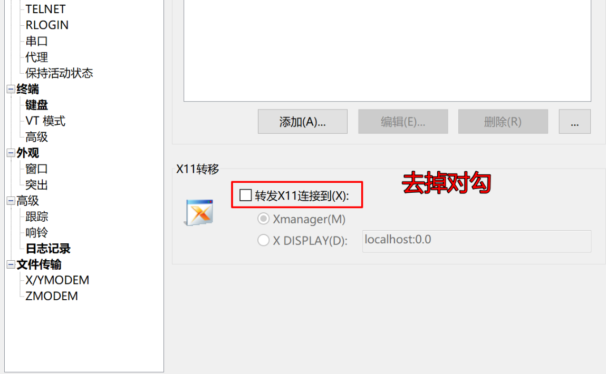
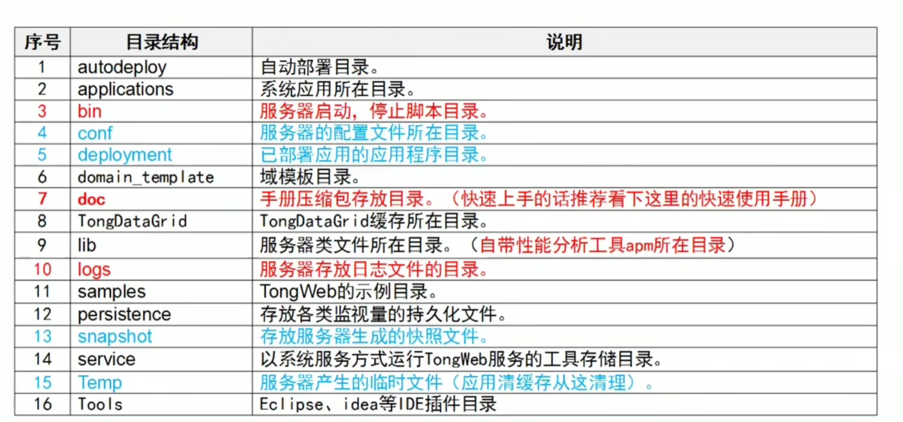

# TongWeb学习笔记

## 1. 安装

* <https://blog.csdn.net/chaliewon/article/details/126527676>
* <https://blog.csdn.net/m0_50157558/article/details/120729802>

1、下载安装包（提前配置好Java8）

```
https://www.aliyundrive.com/s/ANPXCoMJU2K
提取码: 1qc7

https://pan.baidu.com/s/1tNNvch0SdAHqRIbWAYq83g
提取码：jinb
```

2、将bin安装文件和license上传到服务器，执行

```sh
sh Install_TW6.1.5.8_Enterprise_Linux.bin -i console 
# 如果报了以下错误
# Installer User Interface Mode Not Supported
# Unable to load and to prepare the installer in console or silent mode.

# 安装
sudo yum groupinstall "X Window System"
```

会话属性去掉以下



3、将license复制到安装目录下

```sh
mv /root/license.dat /root/TongWweb6.1
```

4、系统时间改为

```bash
date -s "2019-06-01 00:00:00"
```

5、启动，浏览器访问<http://1.1.1.1:9060/console>

```bash
# 前台启动
/root/TongWweb6.1/bin/startserver.sh

#后台启动
/root/TongWweb6.1/bin/startservernohub.sh

# 关闭防火墙，以放开端口
systemctl stop firewalld
```

如果启动报以下错，permGen永生代，在jdk1.8被移除，

```bash
VM warning: ignoring option MAXPermSize=256m； support was removed in 8.0
```

```bash
vi startserver.sh

JAVA_OPTS="-Xms512m -Xmx1024m -XX:MetaspaceSize=512m -XX:MaxMetaspaceSize=512m"
```

## 2. 开始



### 2.1 控制台

* 单节点控制台：<http://ip:9060/console>；
* 集中管理控制台：<http://ip:9060/heimdall>