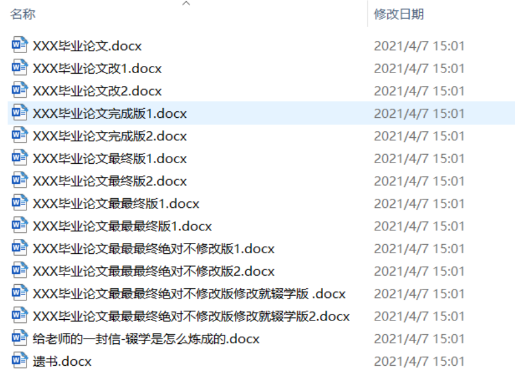

# Git

* Git 常用命令大全：<https://blog.csdn.net/dengsilinming/article/details/8000622>

## 常用命令

* `git config --global user.name 用户名`设置用户签名
* `git config --global user.email 邮箱`设置用户签名
* `git init`初始化本地库
* `git status`查看本地库状态
* `git add 文件名`添加到暂存区
* `git commit -m "日志信息" 文件名`提交到本地库
* `git reflog`查看历史记录
* `git reset --hard 版本号`版本穿梭
* `git rebase -i`合并多个 分支
  * <https://blog.csdn.net/DOT_wen/article/details/127449537>

## 分支操作

* `git branch -v`查看分支
* `git branch 分支名`创建分支
* `git checkout 分支名`切换分支
* `git branch -m oldname newname`修改分支名
* `git branch -m newname`更改当前分支名
* `git branch -d 分支名`删除本地已合并分支
* `git branch -D 分支名`强制删除本地分支
* `git merge 分支名`把指定的分支合并到当前分支上
*  `git branch -a`查看所有远程分支 
*  `git push origin --delete 分支名`删除指定远程分支 
*  `git checkout -b dev origin/dev`，作用是checkout远程的dev分支，在本地起名为dev分支，并切换到本地的dev分支

## 远程仓库操作

* `git remote -v`查看当前所有远程地址别名
* `git remote add 别名 远程地址`添加远程地址
* `git remote rm 别名`删除远程地址
* `git push 别名 分支`推送本地分支上的内容到远程仓库
* `git pull 别名 分支`将远程仓库对于分支最新内容拉下来后与当前本地分支直接合并
* `git clone 远程地址`将远程仓库的内容克隆到本地
* `git push origin --delete 分支名`删除远程分支

## 为什么要用Git



## .gitignore

```
# Compiled class file
*.class

# Eclipse
.project
.classpath
.settings/

# Intellij
*.ipr
*.iml
*.iws
.idea/

# VS Code
.vscode/

# Maven
target/

# Gradle
build
.gradle

# Log file
*.log
log/

# out
**/out/

# Mac
.DS_Store

# others
*.jar
*.war
*.zip
*.tar
*.tar.gz
*.pid
*.orig
temp/

/tomcat.8080
.gitignore
```

## 提交message规范

* 提交描述信息格式: `<type>(<scope>): <subject>`
* type: 操作类型

```
add	        新增功能
update   	更新功能
delete	    删除功能
fix	        修复 BUG
refactor	代码重构
revert	    撤销上次commit
style	    代码风格更改
docs	    修改文档相关内容
```

* scope:影响范围

```
add(用户模块):新增用户编辑个人资料功能
update(用户模块):修改用户编辑个人资料不需要上传头像
delete(购物车模块):删除购物车批量删除商品功能
fix(购物车模块):修复购物车商品数量可以为负数
refactor(全部):初始化系统架构
revert(用户模块):撤销修改用户编辑个人资料不需要上传头
style(会员中心):格式化代码 
docs(api):更新API文档
```

## 分支管理规范

* git分支详解：<https://blog.csdn.net/weixin_43660088/article/details/124489383>
* 在实际开发项目中如何用好git？ - 知乎 (zhihu.com)：<https://www.zhihu.com/question/60110166/answer/2561561742>

### 分支种类

* 主分支（master）
* 开发分支（develop)
* 功能分支（feature)
* 修复分支（hotfix）
* 预发布分支（release）

### 分支描述

* `Master`：主分支，创建 Repository 时默认会生成一个 master 分支。通常情况下 master 分支是受保护的（Protected）。master 分支保存的是稳定的已发布到线上的代码，会使用 tag 来记录发布的版本（tag命名为：tag  + “-” + “版本号”）。master 分支是不允许提交代码的，只能将代码合并（merge）到 master。在蓝绿部署的情况下，绿色部署环境需要部署此分支代码。
* `Develop`：开发分支，从 master 创建。需要注意的是，develop分支的代码是通过feature分支合并而来的。通常情况下我们是不会在 develop 上开发的，因为你不能确定这些是否需要上线（或者说无法确定在哪次迭代上线）。
* `Feature`：功能分支，从 develop 创建。feature 分支是用来开发新功能的，通常情况下新功能开发完毕后会合并的 develop。
* `Release`：预发布分支 从 develop 创建。当一次迭代的功能开发并自测完成后，就可以创建发布分支。该分支通常用于测试，我们不能在该分支上完成除Bug 修复外的其他工作。测试完成后，我们需要将 release 分支合并到 master 进行发布。发布完成后在 master 打上 tag 记录此次发布的版本。在蓝绿部署的情况下，蓝色部署环境需要部署此分支代码。
* `Hotfix`：修复分支，从 master 创建。当我们发现线上 Bug 时，会从 master 分支上对应的 tag 处创建新的 hotfix 分支，用来修复 bug。通常情况下，紧急修复的发布相对简单，在 Bug 修复并测试完成后，可直接合并到 master 进行发布（注意：如果在蓝绿部署的情况下，需要将bug修复之后的代码重新打包，并部署到蓝色环境下等待测试通过后，再将代码合并到master上）。发布完成后在 master打上 tag 记录此次发布的版本，并将 hotfix 合并到 develop。

### 分支命名规范

* 主分支（master）
* 开发分支（develop)
* 功能分支（feature)： `feature-版本号`
* 修复分支（hotfix）： `hotfix-禅道bug号(当前解决了的bug号)-日期(YYYYMMDD)`
* 预发布分支（release）：`release-版本号`

### 多人协作开发分支使用流程


1. 在多人协作开发的情况下，所有分支需要全部上传到云仓库。
2. Master分支用来部署生产环境，release分支用来部署预发布环境。
3. Master、develop、release分支上严禁提交代码,只支持代码合并。
4. 当生产环境发生紧急bug时，需要通过hotfix分支进行bug修复。 bug修复后将hotfix分支打包发布到预发布环境，待测试通过后再将代码合并到master与develop分支上。
5. 当预发布环境产生bug时，代表当前开发的功能版本存在缺陷。 bug修复在原feature分支上修复即可。Bug修复后将代码依次合并到develop和release分支上。
6. Release、feature分支至少要多保存一个版本。例如：当前feature分支在开发1.2功能需求，既当前feature分支名称为feature-1.2，那么git仓库中release分支和feature分支至少要留存feature-1.1和release-1.1版本的分支。

### 单人开发分支使用流程


1. 在单人开发的情况下，master、develop分支需要上传到云仓库，feature分支只在本地保存即可。
2. Master分支用来部署生产环境，develop分支用来部署预发布环境。当生产环境
3. Master分支上严禁提交代码,只支持代码合并。
4. 当生产环境发生紧急bug时，需要通过feature分支进行bug修复，既创建分支：feature-bug-日期。 bug修复后将feature-bug分支打包发布到预发布环境，待测试通过后再将代码合并到master与develop分支上，然后并删除此bug分支。
5. 当预发布环境产生bug时，代表当前开发的功能版本存在缺陷。 bug修复在原feature分支上修复即可。Bug修复后将代码依次合并到develop分支上。
6. Develop分支允许小规模代码提交，例如配置文件修改，参数类型修改。如有代码逻辑修改需要创建新分支。
7. feature分支至少要多保存一个版本。例如：当前feature分支在开发1.2功能需求，既当前feature分支名称为feature-1.2，那么git仓库中feature分支至少要留存feature-1.1版本的分支
