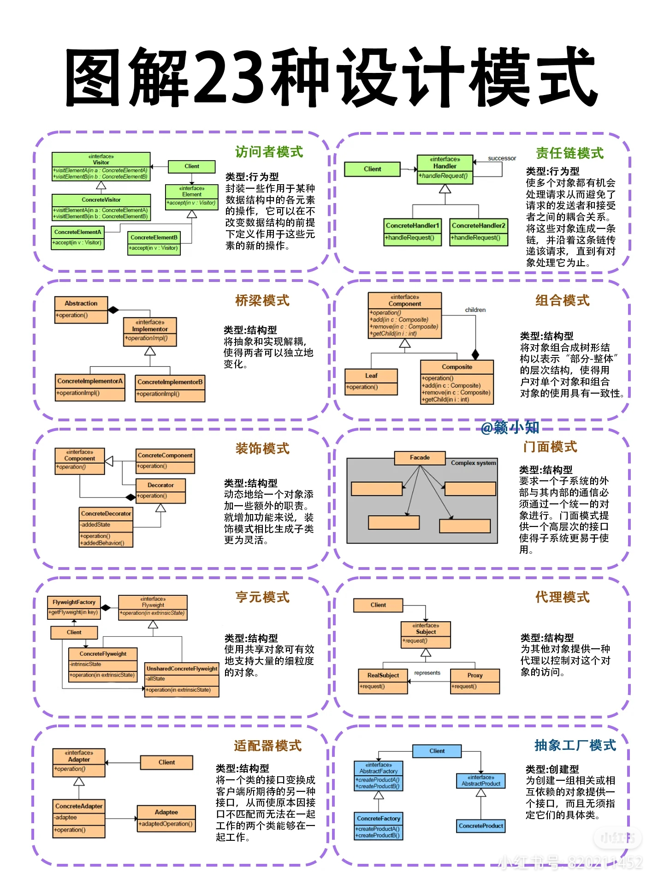
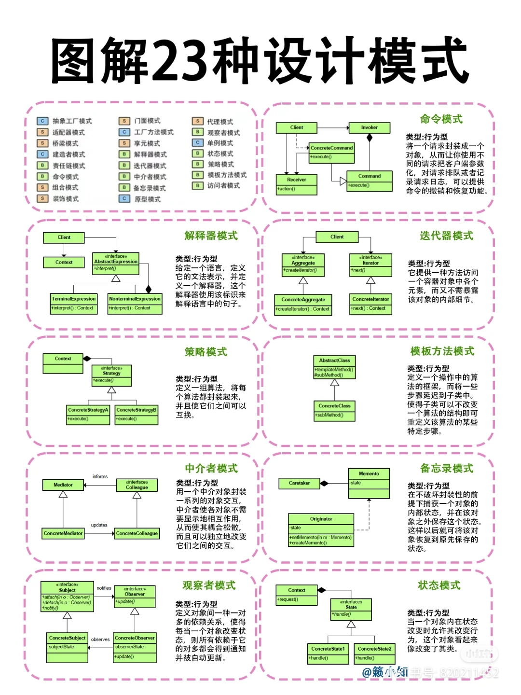

# 软件设计的七大原则

## 开闭原则

* 对扩展开**放**，对修改关**闭**
* 提供抽象接口或抽象类，由实现接口、方法来达到扩展的目地

##  里氏变换原则

* 在继承时，只重写抽象方法，不覆盖方法
* 即，子类可以扩展父类功能，但不应改变原有功能

## 依赖倒转原则

* 依赖时，依赖和被依赖者都应抽象
* 细节依赖于抽象

## 单一职责原则

* 一个类应该只有单一职责的功能

## 接口隔离原则

* 接口中的方法定义应当具体，不可过于冗余、庞大
* 尽量不要让方法强制被实现

## 迪米特原则

* 只与“朋友交流”，不与“陌生人沟通”，不与自己相关联的的对象不应直接访问，（间接访问）
* 朋友：当前对象本身、成员对象、方法参数
* 陌生人：局部变量对象

## 合成复用原则

* 代码复用时，优先考虑使用依赖关系，其次才是继承关系

## 设计模式图解

