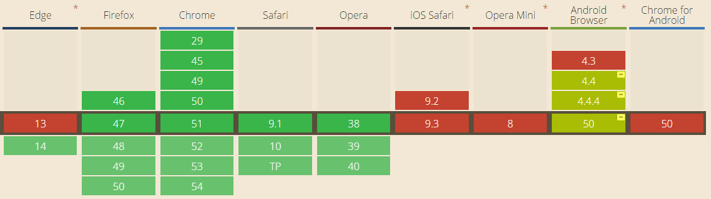

# 浏览器通知Web Notifications



*  教程：
   *  <https://juejin.cn/post/7272199653339234344>
   *  <https://blog.csdn.net/m0_37566424/article/details/128927205>
* Notification.permission
  * 其中`granted`表示用户允许通知，`denied`表示用户嫌弃你，`default`表示用户目前还没有管你。 
* 使用方式` new Notification(title, options) `
* title为必选参数，options为配置参数

## 参数说明

|  属性名  |                             释义                             |
| :------: | :----------------------------------------------------------: |
|   dir    | 默认值是`auto`, 可以是`ltr`或`rtl`，有点类似[direction属性](http://www.zhangxinxu.com/wordpress/2016/03/css-direction-introduction-apply/)。表示提示主体内容的水平书写顺序。 |
|   lang   |        提示的语言。没看出来有什么用。大家可以忽略之~         |
|   body   | 提示主体内容。字符串。会在标题的下面显示。比方说上面的“好啊！(害羞.gif)”。 |
|   tag    |                 字符串。标记当前通知的标签。                 |
|   icon   |              字符串。通知面板左侧那个图标地址。              |
|   data   |                 任意类型和通知相关联的数据。                 |
| vibrate  | 通知显示时候，设备震动硬件需要的[振动模式](https://developer.mozilla.org/en-US/docs/Web/API/Vibration_API#Vibration_patterns)。所谓振动模式，指的是一个描述交替时间的数组，分别表示振动和不振动的毫秒数，一直交替下去。例如[200, 100, 200]表示设备振动200毫秒，然后停止100毫秒，再振动200毫秒。 |
| renotify | 布尔值。新通知出现的时候是否替换之前的。如果设为`true`，则表示替换，表示当前标记的通知只会出现一个。注意都这里“当前标记”没？没错，`true`参数要想其作用，必须`tag`需要设置属性值。然后，不会是默认的叠高楼 |
|  silent  | 布尔值。通知出现的时候，是否要有声音。默认`false`, 表示无声。 |
|  sound   |       字符串。音频地址。表示通知出现要播放的声音资源。       |
| noscreen | 布尔值。是否不再屏幕上显示通知信息。默认`false`, 表示要在屏幕上显示通知内容。 |
|  sticky  | 布尔值。是否通知具有粘性，这样用户不太容易清除通知。默认`false`, 表示没有粘性。根据我自己的猜测，应该和`position`的`sticky`属性值类似。 |

```
`actions`：一个数组，表示通知上的自定义操作按钮；
`badge`：将显示在通知区域中的图标；
`body`：通知的正文内容；
`data`：与通知相关的数据，可在打开通知时使用；
`dir`：显示通知文本的方向，可以是 "ltr"（从左到右）或者 "rtl"（从右到左）；
`icon`：将用作通知图标的 URL；
`image`：在通知上显示的图像的 URL；
`lang`：通知的语言，如 "en-US" 或者 "zh-CN"；
`renotify`：如果通知已经存在，是否应该替换它而不是创建一个新的通知；(同TAG)
`requireInteraction`：如果通知被创建时正在运行可见的浏览器窗口，则需要用户手动关闭通知；
`silent`：不要以声音或震动的方式通知用户；
`tag`：与通知相关的标识符，类似于ID
```


## 示例代码

```html
<!DOCTYPE html>
<html lang="en">
<head>
    <meta charset="UTF-8">
    <meta name="viewport" content="width=device-width, initial-scale=1.0">
    <title>Document</title>
</head>

<body>
    <h1>测试</h1>

    <button id="btn">测试</button>
    
    <script>
        function notify(title, msg, jumpUrl) {
            const Notification = window.Notification || window.webkitNotifications
            // 先检查浏览器是否支持 Notification
            if (!window.Notification || Notification.permission === 'denied') {
                console.log('浏览器不支持或者没有权限')
                return;
            }
            // 配置
            const config = {
                // 文字方向，auto / ltr / rtl
                dir: 'ltr',
                // 赋予通知一个ID，以便在必要的时候对通知进行刷新、替换或移除
                // tag: new Date().getTime(),
                tag: "tongzhi",
                // 一个图片的URL，将被用于显示通知的图标
                icon: 'path/to/icon.png',
                // 通知中额外显示的字符串
                body: msg,
                // 是否一直保持有效
                // requireInteraction: true, // 永不关闭，只能手动关闭
                renotify: true, // 同tag下不会叠高高，而是替换
            }

            // 用户已经授权
            let noti = null;
            if (Notification.permission === 'granted') {
                noti = new Notification(title, config)
            } else {
                // 申请用户授权
                Notification.requestPermission(function (permission) {
                    // 用户同意授权
                    if (permission === 'granted') {
                        noti = new Notification(title, config)
                    } else {
                        console.log("浏览器不支持API");
                        return;
                    }
                })
            }
            if (noti) {
                noti.onclick = function () {
                    window.open(jumpUrl);
                }
            }
        }

        function send() {
            notify("标题", "消息" + new Date().getTime(), "https://www.baidu.com")
        }

        document.getElementById("btn").onclick = function () {
            send();
        };
    </script>
</body>

</html>
```

